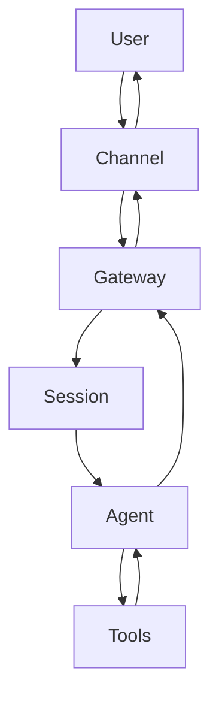

> One-line summary: OpenClaw is not “a smarter model”—it’s an **agent runtime** that stays online (chat I/O), can run **scheduled jobs**, and can call **tools** with verifiable side effects (files/commands/web), so work becomes repeatable instead of a one-off chat.

### Say it plainly: OpenClaw solves runtime problems

Most “agents” are great in demos and vague in production. They can reason, but they don’t reliably:

- stay connected to real chat channels
- run on a schedule
- execute bounded actions with traceable outputs

OpenClaw is the layer that makes those things boring (in a good way): **gateway + sessions + tools + scheduler + workspace**.

If you already use Claude Code, the split is simple:

- Claude Code: strong at the **repo-local loop** (edit/test/iterate).
- OpenClaw: strong at the **always-on ops loop** (chat I/O, scheduling, delivery, tool orchestration).

### 5-minute check: confirm you’re actually running a runtime

```bash
openclaw status
openclaw channels status
openclaw gateway status
```

What “OK” looks like:

- `openclaw status` shows the gateway is reachable.
- `openclaw channels status` shows your target channel (e.g. Telegram) is healthy.

For a copy-paste friendly diagnosis snapshot:

```bash
openclaw status --all
```

### Mental model: what happens when a message arrives



Translation:

- Gateway handles **I/O + routing + scheduling**.
- Session/Agent handles **one turn of “do the work”**.
- Tools handle **verifiable side effects**.

### Core objects (and their boundaries)

This is the set of nouns you’ll see in config/logs/CLI. The goal is not definitions—it’s correct usage.

**Gateway**

- What it is: the always-on process that keeps channels connected, routes messages, and runs the scheduler.
- Entry points: `openclaw gateway status`, `openclaw gateway restart`.
- Non-goal: it’s not “where intelligence lives”. Mixing heavy tool work into the I/O loop increases the blast radius.

**Channel**

- What it is: an adapter for Telegram/WhatsApp/Discord/…
- Entry points: `openclaw channels status`.
- Boundary: channel health is an I/O concern; don’t debug it by changing prompts.

**Session**

- What it is: one execution context triggered by an incoming message; it may run multiple tool calls.
- Boundary: when tools are involved, “no reply” is often “waiting on an external action”, not “the model is dumb”.

**Tool**

- What it is: a bounded capability that produces an auditable effect.
- Examples: file I/O, shell exec, web fetch/search, browser automation, cron scheduling.
- Boundary: powerful tools require permissions/approvals; otherwise you’ve built a prompt-injection-powered shell.

**Skill**

- What it is: an SOP that makes outputs consistent.
- Correct use: fix quality gates (evidence, entry points, recipes, commit/push), but don’t force identical openings or symmetric outlines.

**Workspace / Memory**

- Workspace: where outputs should land as files (diffable, reviewable, reusable).
- Memory: continuity for preferences and lightweight context; it is not a substitute for writing key facts to files.

**Cron vs Heartbeat**

- Cron: exact alarm clock, persistent jobs, run history.
- Heartbeat: periodic sweep, best for batch checks and “it’s okay if it drifts”.

Useful entry points:

```bash
openclaw cron status
openclaw cron list
openclaw cron runs --id <jobId> --limit 20
```

### A “real” OpenClaw usage pattern: turn tasks into deliverables

OpenClaw’s advantage over prompt+loop agents is not cleverness. It’s that it nudges you into an engineering loop:

- write outputs to workspace files
- commit to git (reviewable, revertible)
- schedule recurring work (cron)
- deliver results back to chat

That combo is what makes an assistant usable every day.

### Recipes (copy/paste level)

#### Recipe: run something on a schedule and keep it traceable

Goal: a daily/weekly job you can inspect after the fact.

Start by verifying the scheduler is alive:

```bash
openclaw cron status
openclaw cron list
```

Success looks like:

- you have a jobId
- `openclaw cron runs --id <jobId>` shows `ok` or a concrete error

Common pitfall:

- assuming cron runs “in the model”. It runs **in the Gateway process**—if the gateway isn’t always on, cron won’t fire.

#### Recipe: make writing a deliverable (not chat vapor)

Goal: an article that exists as a file and can be reviewed.

Success looks like:

- the file lands under `blog.md/docs/clawbot/`
- you have a git commit (diff/revert)

Common pitfall:

- producing text in chat only; nothing is versioned, nothing is reusable.

### Why OpenClaw got traction (engineering answer)

A lot of people hit the same wall: the hard part of “agents” is not reasoning—it’s getting reliable I/O + scheduling + bounded actions + traceable outputs.

OpenClaw makes that wall smaller:

- stable chat adapters (I/O)
- built-in scheduler (cron/heartbeat)
- tool boundaries (auditability + permissions)
- file-native workspace (deliverables)

### Comparisons (same axes, no vibes)

**OpenClaw vs Claude Code**

- Claude Code: optimized for codebase iteration (edit/test/iterate).
- OpenClaw: optimized for long-running assistant ops (chat I/O, scheduling, delivery, orchestration).
- Practical rule: use Claude Code when the repo is the product; use OpenClaw when the workflow lives in chat and needs scheduling.

**OpenClaw vs Codex**

- Codex is an engine (model capability).
- OpenClaw is a runtime (integration + ops).
- Don’t compare “smartness” first. Compare whether the task becomes a repeatable, auditable loop.

**OpenClaw vs prompt+loop agents**

- prompt+loop is fine for demos.
- it degrades with time and state unless you add boundaries: scheduling, storage, permissions, run history.
- OpenClaw chooses those boundaries up front.

### Non-goals (avoid misuse)

- OpenClaw doesn’t replace your network/proxy stack. Unstable egress will surface as tool timeouts.
- OpenClaw is not an autonomous entity. The more powerful the toolset, the more you need least-privilege + approvals.

### Takeaways (3 lines)

- OpenClaw’s core value is runtime: always-on I/O + scheduling + tools + workspace.
- Use it by centering a workflow around deliverables (files + commits), not around chat.
- Claude Code and OpenClaw are complementary: repo-local loop vs always-on ops loop.
