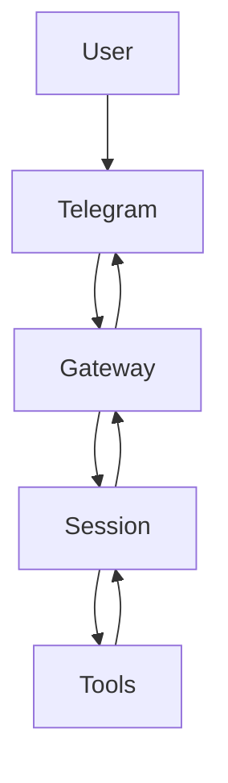

> 一句话摘要：把 OpenClaw 当作“消息网关 + 会话执行器 + 工具编排器”来用：先 5 分钟跑通一条闭环（能回消息），再理解 Gateway/Session/Tool 的职责边界，最后给一套从“Telegram 能发但 OpenClaw 不回”出发的分段排障路径。

### 三个症状（对号入座）

- Telegram 正常，但 OpenClaw 偶尔不回：优先怀疑 **Gateway 出站链路 / 代理 / DNS / 进程卡住**。
- `/status` 看起来一切 OK，但工具调用常超时：优先怀疑 **网络出站（代理/TUN）** 或 **web_fetch/web_search 的可达性**。
- 能聊天，但定时提醒不准时或不触发：优先怀疑 **cron 不是在 Gateway 里跑**（Gateway 没常驻 / cron 被禁用）。

### Quickstart：5 分钟确认“能回消息”

目标：确认 Gateway 在线、Telegram 账号健康、会话能跑完。

```bash
openclaw status
openclaw status --deep
openclaw channels status
```

成功标志：

- `openclaw status` 里 Gateway reachable、Telegram State = OK。
- `openclaw status --deep` 的 probe 不报关键错误（深探针会更严格）。

如果出现“能发消息但不回”，先做一次最小恢复：

```bash
openclaw gateway restart
```

### OpenClaw 到底是什么（以及为什么会觉得“复杂”）

OpenClaw 本质上把三件事拆开了：

- **Gateway（网关）**：负责把 Telegram/WhatsApp/Discord 等平台消息“收进来、送出去”，并维护账号连接、速率限制、重试等 I/O 细节。
- **Session（会话执行）**：负责处理一次对话回合，把输入→计划→工具调用→输出串起来。
- **Tools（工具）**：负责产生可验证的外部效果（读写文件、跑命令、抓网页、发消息、定时任务）。

“复杂”往往来自概念多，但好处也很工程化：故障能按边界定位，能力能按工具扩展。

### 心智模型：一条消息怎么走完链路



一句话总结：**“不回”一定卡在某一段边界上**——先确认消息有没有进 Gateway，再确认 Session 是否完成，再确认 Tools 是否被网络/权限卡住，最后再看回复是否成功送回 Telegram。

### Gateway：收发口做对了，后面才有意义

Gateway 的工作目标只有一个：可靠收发 + 可靠调度。

- 入口（怎么用）：
  - 查看网关状态：`openclaw gateway status`
  - 重启网关：`openclaw gateway restart`
  - 总览诊断：`openclaw status --all`
- 常见失败模式：
  - 现象：Telegram 端“消息已送达”，但 OpenClaw 不回；或偶发不回。
  - 定位顺序：
    1) `openclaw gateway status` 看进程是否在跑、RPC probe 是否 ok
    2) `openclaw status --deep` 看 Telegram probe
    3) 看日志 `/tmp/openclaw/openclaw-YYYY-MM-DD.log`（是否有 reconnect/timeout）
    4) 若使用代理/TUN：检查出站是否被分流成 DIRECT 或走了不稳定节点

### Session：为什么“看着在线”却不回

Session 把一次回复拆成多个步骤（含工具调用）。这类系统最常见的卡点不是“不会写字”，而是“在等一个外部动作”。

- 入口（怎么用）：用 `openclaw status` 看 sessions 是否活跃、是否有异常提示。
- 常见失败模式：
  - 现象：偶发卡住、长时间无回复。
  - 定位顺序：
    1) 看日志是否有 tool 超时（web_fetch/browser/exec）
    2) 如果是网络相关工具，先验证 DNS/代理稳定性（见下文排障）

### Tools / Skills：工具负责“做事”，Skill 负责“像工程交付”

- Tool 是原子动作：读写文件、执行命令、抓网页、发消息、建定时任务。
- Skill 是写作/运维的 SOP：把“这次写得还行”变成“每次都能交付”，并且明确深度与证据要求。

常见误区：把 Skill 当成“固定模板”。更稳的做法是：用 Skill 固定质量门槛（证据、入口、失败模式），但终稿要做一次去模板化编辑。

### Cron vs Heartbeat：定时不是一个东西

- **cron**：Gateway 内置闹钟，精确触发，适合提醒/准点任务；任务持久化在 `~/.openclaw/cron/`。
- **heartbeat**：可漂移巡检，适合批量检查（减少 API 调用），更像“定时问一声要不要做事”。

入口（怎么用）：

```bash
openclaw cron list
openclaw cron status
openclaw cron runs --id <jobId> --limit 20
```

失败模式：

- 现象：定时任务完全不跑。
- 定位顺序：
  1) Gateway 是否常驻（cron 在 Gateway 里跑，不是模型里跑）
  2) `openclaw cron status` 是否 enabled
  3) job 是否 due、run history 是否有 error/backoff

### Recipes：照抄就能用

#### Recipe 1：把“偶发不回”压成可诊断问题

目标：把模糊的“不回”变成可定位的边界。

步骤：

```bash
openclaw status --deep
openclaw channels status
openclaw gateway status
```

成功标志：

- 深探针 Telegram OK；Gateway reachable；进程运行。

常见坑：

- 代理/TUN 把某些流量分到 DIRECT，或者 DNS fake-ip 导致某些连接没有被正确接管（表现为“偶发”）。

#### Recipe 2：验证 cron 真的在跑（不是“以为它会跑”）

目标：确认 cron scheduler 工作、job 记录可追踪。

步骤：

```bash
openclaw cron status
openclaw cron list
openclaw cron runs --id <jobId> --limit 20
```

成功标志：

- `cron status` 有未来的 next wake；`runs` 有 ok 或明确错误。

常见坑：

- Gateway 没常驻：cron 不会触发。
- 时间戳没带时区：ISO 无时区按 UTC 处理，容易“看起来晚了/早了”。

### 排障：从“Telegram 能发但 OpenClaw 不回”开始

现象：Telegram 一切正常，但 OpenClaw 偶发不回。

最快分流：

- 同时刻其他 bot/频道是否正常更新？
  - 都不正常：优先怀疑当前网络/节点对 Telegram 不稳。
  - 只有 OpenClaw 不回：继续往下。

分段验证：

1) Gateway 是否在跑：`openclaw gateway status`
2) 渠道是否健康：`openclaw status --deep` / `openclaw channels status`
3) 是否卡在工具：看 `/tmp/openclaw/openclaw-*.log`，重点找超时/重连
4) 网络与代理：
   - 如果开了 Clash TUN，`dig` 出现大量 `198.18.x.x`（fake-ip）不一定是错，但**它改变了系统 DNS 的语义**；规则/分流抖动时容易出现“偶发不回”。
   - 处理方向通常是：稳定 Telegram/API 走同一策略组；必要时把 DNS 模式切到 `redir-host` 验证稳定性变化。

最小恢复动作：

```bash
openclaw gateway restart
```

### 代价、边界与 non-goals

- 代价：引入分层（Gateway/Session/Tools）后，概念变多；但排障边界清晰。
- 边界：如果出站网络不稳定（代理规则漂移、UDP 被限、DNS 被接管），工具链会出现“看似随机”的超时。
- non-goals：OpenClaw 不替代网络基础设施；代理/TUN 的稳定性仍要用工程手段保障。

### 总结

- OpenClaw 不需要“全部懂了才能用”：先用 `status / channels / gateway` 跑通闭环，再按边界逐层理解。
- “不回”优先按链路分段定位：Gateway → Channel → Tool/Network → Delivery。
- 需要写得像工程交付：把深度和证据要求固定进 skill，把结构节奏留给终稿编辑。
