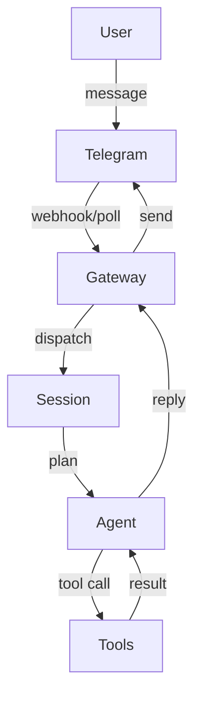

> 一句话摘要：把 OpenClaw 当成“快递分拣中心”来看，弄清 Gateway / Session / Tool / Cron 的职责边界，并给出一套可复制的排障顺序（尤其是“消息发出去了但 OpenClaw 没回”）。

### 开场故事：一个真实失败现场

常见现场是这样的：Telegram 里能正常发消息、也能刷别的频道，但发给 OpenClaw 之后“已送达”却迟迟没有回复。

这种失败很折磨人的点在于：表面上看像是“机器人坏了”，但实际可能是任意一个环节出了问题——从 Telegram 出站、到本机代理（TUN/fake-ip）、到 OpenClaw 进程本身。

为了把排障从“玄学”变成“可复现的定位”，需要先把 OpenClaw 的运行链路拆开。

### 核心理念（一句话）

OpenClaw 的可维护性来自 **明确的职责切分**：Gateway 负责“收发包”，Session 负责“处理一次对话”，Tools 负责“做事”，Cron/Heartbeat 负责“按时触发”。排障时按链路逐段验证即可。

### 术语地图（先读这段）

以下术语贯穿全文（用“快递分拣中心”作比喻，后续不混用别的比喻）：

- **Gateway**：分拣中心的“收发货口”。负责把外部平台（Telegram/Slack/…）的消息收进来、把回复送回去。其目标是“可靠收发”，不负责深度思考。
- **Session**：一票快递在分拣中心内部的“处理工单”。一条用户消息进来，触发一次处理（可能包含工具调用），产出一条或多条回复。
- **Agent**：某种“分拣工人”的配置集合（模型、系统指令、可用工具、记忆策略）。同一个 Gateway 可以挂多个 Agent。
- **Tool**：分拣中心里的“专用工位/设备”（读文件、跑命令、开浏览器、发消息、定时任务等）。其目标是“在边界内产生可验证的外部效果”。
- **Skill**：一套“标准作业指导书（SOP）+ 约束 + 模板”。遇到特定任务（写博客、做健康检查、用 GitHub CLI）时，用 skill 把行为固定下来，降低随机性。
- **Heartbeat**：分拣中心的“定时巡检铃”。在允许的频率下批量做检查，适合“可以漂移”的周期性任务。
- **Cron**：分拣中心的“闹钟”。严格按时间触发，适合精确提醒或一锤子任务。

### 方案总览：一条消息是怎么走完链路的？

从 Telegram 到回复的主线可以简化为下面这个流：

图后一句话总结：**“没回”一定发生在某一段边界上**——要么消息没进 Gateway，要么 Session 没跑完，要么 Tool 卡住，要么回复没从 Gateway 送回 Telegram。

### 关键机制：为什么要有 Gateway（而不是直接让 Agent 处理一切）？

要回答的问题：Gateway 到底在保护什么？

- **它是什么**：一个常驻进程，负责连接外部平台、管理会话路由、承接定时任务与消息投递。
- **为什么需要它**：外部平台 I/O（网络波动、重试、速率限制）和“智能处理”（模型推理、工具执行）失败模式不同。拆开后，故障隔离更清晰。
- **怎么决定它的边界**：Gateway 只做“收/发/路由/调度”，不做重业务逻辑；业务逻辑落在 Session/Agent。
- **错了会怎样**：如果把复杂逻辑塞进 Gateway，任何一个 tool 卡住都可能拖垮整体收发，最终表现为“全体不回”。

这段设计你要记住三件事：
- 解决了：把“收发可靠性”从“智能处理复杂性”中隔离出来。
- 代价是：多了一层概念，需要理解路由与会话。
- 容易踩坑在：把排障当成“模型问题”，忽略 Gateway 的网络/代理/平台投递。

### 关键机制：Session 在解决什么问题（以及为什么“没回”经常是 Session 卡住）？

要回答的问题：为什么同样是“发一条消息”，需要一个 Session？

- **它是什么**：一次处理上下文（输入消息 + 中间步骤 + 输出）的容器。
- **为什么需要它**：允许把一次响应拆分成多个步骤（例如先查文件再写总结），并能记录状态与错误。
- **怎么决定它的生命周期**：通常“一条用户消息触发一轮处理”，期间可以多次调用工具；处理完成即结束。
- **错了会怎样**：如果 Session 被某个工具调用阻塞、或网络请求长时间超时，就会出现“消息收到了但不回复”。

这段机制你要记住三件事：
- 解决了：把多步处理变成可追踪的一次工单。
- 代价是：中间环节增多，任何一步卡住都会拖延最终回复。
- 容易踩坑在：只盯着 Telegram，忘了检查 tool 是否在等待、DNS/代理是否导致外部请求超时。

### 关键机制：Tools 与 Skills 的关系是什么（以及为什么要“记得用 skills”）？

要回答的问题：为什么同样是“写一篇教程”，要用 skill 而不是随便写？

- **Tool 是什么**：原子能力（读写文件、执行命令、查网页、发消息、建 cron）。
- **Skill 是什么**：围绕某类任务的固定流程与质量约束（模板、检查清单、输出路径、提交规范）。
- **为什么需要 Skill**：把“这次写得还行”变成“每次都能交付”，尤其适合教程、运维文档、发布流程。
- **怎么决定用哪个 Skill**：当任务描述与某个 skill 的 `<description>` 高度匹配时，优先使用该 skill 的 SOP。
- **错了会怎样**：不使用 skill 往往导致结构散、缺少术语地图、缺少落地建议、忘记提交，最后文章难复用。

这段关系你要记住三件事：
- 解决了：把交付质量标准化。
- 代价是：需要遵循模板与约束（例如 Mermaid 标签尽量用英文）。
- 容易踩坑在：只堆“功能列表”，没有“失败模式 + 排障顺序”。

### 关键机制：Heartbeat vs Cron，什么时候用哪个？

要回答的问题：为什么有两个“定时”概念？

- **Heartbeat 是什么**：可漂移的巡检触发器，适合把多项检查合并、减少外部 API 调用。
- **Cron 是什么**：严格按时间触发的闹钟，适合精确提醒或一次性任务。
- **为什么需要区分**：有的需求允许“半小时内做都行”，有的需求必须“9:00 准点”。
- **怎么决定**：
  - 允许漂移、需要上下文合并 → Heartbeat
  - 精确时间、一次性提醒、独立任务 → Cron
- **错了会怎样**：用 Heartbeat 做精确提醒会错过；用 Cron 切太碎会导致管理成本上升。

这段机制你要记住三件事：
- 解决了：把“定时巡检”和“精确定时”分开建模。
- 代价是：多一个选择点。
- 容易踩坑在：把所有定时都塞进 Cron，结果闹钟太多、维护困难。

### 落地建议（今天就能用）：从“没回”开始的排障顺序

以下顺序的目标是：每一步都能把问题缩小到一个边界内（收件口/工单/工位/发件口）。

- **确认 Telegram 侧是否正常**：同一时刻，其他机器人/频道是否能更新？
  - 若都异常：优先怀疑当前网络/节点对 Telegram 不稳定。
  - 若仅 OpenClaw 不回：继续往下。

- **确认 Gateway 是否在线（收发货口是否在上班）**：
  - `openclaw gateway status`
  - `openclaw status`

- **确认是否是网络/代理导致的出站失败（尤其是 TUN/fake-ip）**：
  - 观察 `dig` 是否大量返回 `198.18.x.x`（典型 fake-ip 段）。
  - 若确实是 fake-ip：短期验证可把 DNS enhanced-mode 切到 `redir-host` 观察稳定性变化；或将 Telegram 强制走稳定策略组。

- **确认 Session 是否卡住（工单是否被某个工位堵死）**：
  - 若 OpenClaw 有日志入口，优先看“最近一次 tool 调用是否超时”。
  - 常见卡点：web_fetch/web_search 被代理/DNS 影响；browser 自动化等待页面加载；某条命令 hang 住。

- **最小恢复动作（不改架构、不动数据）**：
  - `openclaw gateway restart`

### 边界与反模式

- **反模式：把一切归因于“模型不聪明”**。
  - 失败模式：实际上是 DNS/代理导致 tool 超时，模型再聪明也会卡住。

- **反模式：TUN + fake-ip 开着但不知道自己开了**。
  - 失败模式：`dig` 看起来“DNS 错了”，但真实情况是透明代理接管；当规则/节点抖动时会出现“偶发不回”。

- **边界：如果运行环境没有稳定公网出站**。
  - 失败模式：平台投递与外部工具都不可用，只能做本地文件类工具；需要先解决网络可达性。

### 总结

- 这篇文章最重要的 3 句话：
  - OpenClaw 可以被当成“快递分拣中心”：收发（Gateway）与处理（Session/Agent）分层。
  - “没回”不是玄学，按链路分段验证就能定位到边界。
  - Tools 负责做事，Skills 负责把交付标准化；写教程/运维文档优先走 skill 流程。

- 下一篇可延展主题：
  - TUN/fake-ip 与 OpenClaw 出站稳定性的系统化配置建议（含 Clash/Mihomo 参数）。

### 附录：常用命令索引

- 查看整体状态：`openclaw status`
- 查看 Gateway：`openclaw gateway status`
- 重启 Gateway：`openclaw gateway restart`
- 检查 DNS 解析：`dig +short A example.com` / `dig +short AAAA example.com`
