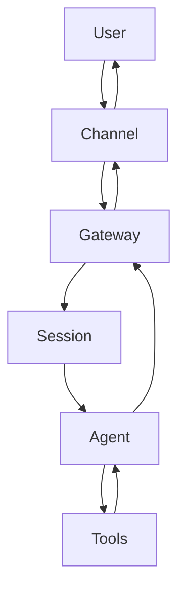

> 一句话摘要：这是一份面向工程使用的 OpenClaw 手册——先用最短路径跑通“消息进来→工具执行→消息出去”，再把 Gateway/Session/Tool/Skill/Cron/Memory 这些概念讲清楚其职责边界，最后用同一套维度对比 OpenClaw、Claude Code、Codex（以及“老式 agent”）。

### 这份手册的定位（先把边界钉死）

OpenClaw 不是“一个更聪明的模型”，也不是“一个写 prompt 的框架”。它更像是把 agent 变成可用系统的一层 **运行时（runtime）**：

- 接入真实世界的输入输出（Telegram/WhatsApp/Discord…）
- 组织可验证的外部动作（工具：文件/命令/浏览器/定时任务…）
- 给工程使用的调度、权限、会话、交付结构（cron/heartbeat、allowlist、skills、workspace/memory）

这份文档以“使用手册”为主：**入口、配方、边界**优先；架构解释只写到足够支撑正确使用。

### Quickstart：跑通一个闭环（5 分钟）

目标：确认 OpenClaw 处在“可用状态”：Gateway 常驻、渠道可达、能执行最基础的命令式诊断。

```bash
openclaw status
openclaw channels status
openclaw gateway status
```

成功标志（经验标准）：

- `openclaw status` 里 Gateway reachable，且渠道（如 Telegram）状态为 OK。
- `openclaw gateway status` 显示运行中（running）且 RPC probe ok。

如果只想快速看更全的诊断输出（可复制给别人）：

```bash
openclaw status --all
```

### 概念地图：OpenClaw 的核心对象有哪些？

下面这些概念是“会出现在命令行/配置/日志里”的工程对象。理解它们的边界，后面所有功能才不会混。

- **Gateway**：网关进程。负责渠道连接、消息收发、会话路由、定时调度。
- **Channel**：外部平台适配（Telegram/WhatsApp/Discord/…）。Gateway 通过它“收包/发包”。
- **Session**：一次对话的执行上下文。输入消息 → 规划 → 工具调用 → 输出回复。
- **Agent**：一套处理配置（模型、提示词、可用工具、记忆策略）。同一个 Gateway 可承载多个 agent。
- **Tool**：可验证外部动作的原子能力（读写文件、exec、web_fetch、browser、message、cron…）。
- **Skill**：针对某类任务的“作业指导书（SOP）”。固定流程与质量门槛，降低随机性。
- **Workspace**：本地文件工作区。技能与记忆以文件为中心沉淀在这里。
- **Memory**：对话连续性与偏好/约定的持久化机制（按 OpenClaw 的 memory 插件实现）。
- **Heartbeat**：周期性触发器（可漂移），适合批量巡检与轻提醒。
- **Cron**：精确定时调度器（准点/一次性/周期性）。运行在 Gateway 内，任务持久化。

### 心智模型：一条消息进来之后发生了什么



一句话：Gateway 解决“收发与调度”，Agent/Session 解决“如何处理”，Tools 解决“如何对外产生效果”。

### Gateway：为什么要单独做一层网关

如果把“外部平台 I/O（收发、重试、速率限制、连接保活）”和“智能处理（模型推理、工具执行）”揉在一起，系统会变得很难稳定：任何一个工具超时都可能拖垮整体收发。

Gateway 的设计目的就是把 I/O 故障域隔离出来，让系统更像工程系统，而不是 demo。

常用入口：

```bash
openclaw gateway status
openclaw gateway restart
```

### Session：为什么同样是聊天要引入会话执行器

工程上最关键的一点：一次回复往往不是“直接生成文本”，而是多步动作的组合，例如：

- 读文件 → 总结 → 写文件 → 提交 git
- 搜索/抓取网页 → 提炼 → 发到 Telegram
- 定时任务触发 → 执行固定流程 → 产出日报

Session 是把这些多步动作串起来、可追踪、可中断的容器。它让 agent 从“只会说话”变成“能完成任务”。

### Tools：为什么强调“可验证外部动作”

OpenClaw 的 tool 不是为了炫技，而是为了两个工程目标：

- **可验证**：读写到哪个路径、执行了什么命令、抓取了哪个 URL——都有证据。
- **可控边界**：工具有明确输入输出，权限可控（allowlist/审批）。

典型工具类别（举例）：

- 文件：read/write/edit
- 命令：exec/process
- Web：web_search/web_fetch/browser
- 调度：cron
- 消息：message

### Skills：为什么你会感觉“模板化”，以及正确用法是什么

Skill 的价值是把“交付质量门槛”固化下来：

- 该有 Quickstart 就必须有
- 该给入口/失败模式就必须给
- 该 commit/push 就必须做

但 skill 不应该把文章写成“同一套开头 + 同一套结构”。更稳的策略是：

- **固定质量标准（checklist）**，不固定写作节奏
- 草稿阶段用模板，终稿阶段必须去模板化（改标题、删模板语气、打散对称列表）

### Cron 与 Heartbeat：定时能力怎么用

如果希望“9:00 准点提醒”或“每晚跑一遍任务”，使用 cron。

常用入口：

```bash
openclaw cron status
openclaw cron list
openclaw cron runs --id <jobId> --limit 20
```

如果希望“每隔一段时间巡检一下、合并处理多件事”，使用 heartbeat。

这两者的差异是工程边界差异：cron 是精确定时器，heartbeat 更像批处理轮询。

### Recipes：把 OpenClaw 用成“工程工具”

下面给出三类高频配方。每个配方都故意写成“照抄即可”的形式。

#### Recipe 1：用 OpenClaw 做一个可复用的写作/整理流水线

目标：把一次性写作变成可重复交付（例如输出到 `blog.md/docs/clawbot/` 并提交）。

步骤（示例）：

- 明确输出路径与提交动作（让产出可追踪）。
- 让 agent 使用 blog-writing skill 的 checklist 固定质量门槛。

成功标志：

- 产出落盘 + 有 commit（可回滚、可 diff）。

常见坑：

- 只生成文本不落盘，等于不可复用。

#### Recipe 2：定时做“背景任务”（日报/摘要/巡检）

目标：每天固定时间产出一条结构化结果。

步骤（命令入口）：

```bash
openclaw cron list
openclaw cron status
```

成功标志：

- job 有 run history（`cron runs` 可查），产出能送达渠道。

常见坑：

- 误以为 cron 在“模型里”跑；实际上 cron 在 Gateway 里跑，Gateway 必须常驻。

#### Recipe 3：把“Web 信息 → 可读摘要 → 发回聊天”做成固定动作

目标：把网页内容抓取、提炼、归档，而不是“看一眼就丢”。

步骤：

- 用 web_fetch 获取主内容（静态页优先）。
- 复杂站点再用 browser。
- 把摘要写入 workspace（可检索），必要时再发回渠道。

成功标志：

- 有落盘结果（markdown）+ 可追溯 URL。

常见坑：

- 把抓取当成浏览器自动化；web_fetch 不执行 JS，JS-heavy 站点要换 browser。

### 对比：OpenClaw vs Claude Code vs Codex vs “老式 agent”

这里按同一套维度对齐：目标、运行位置、I/O、调度、工具、交付形态。

- **OpenClaw**
  - 目标：长期在线的个人助手/自动化运行时（渠道接入 + 工具编排 + 调度 + 交付）。
  - 运行位置：本机/服务器的 Gateway 常驻进程。
  - I/O：原生接聊天渠道；支持主动发送、定时触发。
  - 调度：内置 cron/heartbeat。
  - 工具：文件/命令/浏览器/消息/定时等。
  - 交付：以 workspace 文件为中心（可版本化）。

- **Claude Code**
  - 目标：在“代码工作区”里做高质量编码协作（更像一个 IDE/Repo 里的 agent）。
  - 运行位置：开发机本地 CLI/环境。
  - I/O：主要面向 repo 文件、终端、测试；不以多渠道消息网关为核心。
  - 调度：可以脚本化，但不把“长期在线调度器”作为产品核心。
  - 工具：强在代码理解/修改/执行与迭代。
  - 交付：以代码变更（diff/commit）为主。

- **Codex（这里指模型/编码能力与其交互形态）**
  - 目标：提供强编码/推理能力。
  - 运行位置：取决于承载它的产品形态（IDE、API、CLI、网关）。
  - I/O/调度/工具/交付：不是 Codex 本体决定，而是“外层运行时”决定。
  - 结论：Codex 更像发动机；OpenClaw/Claude Code 更像整车（但车型不同）。

- **“老式 agent”（prompt + loop 的那类）**
  - 目标：快速验证“能不能自动做事”。
  - 常见短板：缺少稳定 I/O、权限边界与可追踪交付；跑久了之后状态不可控。
  - OpenClaw 的差异：更强调工程边界（会话/工具/调度/权限/落盘）。

### 边界与 non-goals（避免误用）

- OpenClaw 不是一个“替你决定一切”的自治体；它更像一个可控的自动化执行环境。
- OpenClaw 不替代网络/代理基础设施；如果出站不稳定，工具链会出现超时或失败。
- OpenClaw 的优势来自“可验证与可追踪”，所以要尽量把结果落到 workspace（而不是只在聊天里飘）。

### 总结

- 作为使用手册的核心结论：先用 `status / channels / gateway` 把运行时状态确认清楚，然后围绕工具与调度建立可复用的工作流。
- 作为架构理解的核心结论：Gateway 把 I/O 与推理解耦；Session 把多步任务串成可追踪回合；Tools 把外部动作变成可验证接口；Skills 把交付质量固定下来。
- 作为对比结论：Claude Code 强在“代码协作”，OpenClaw 强在“长期在线 + 多渠道 + 调度 + 工具编排”，Codex 是能力内核而不是运行时。
