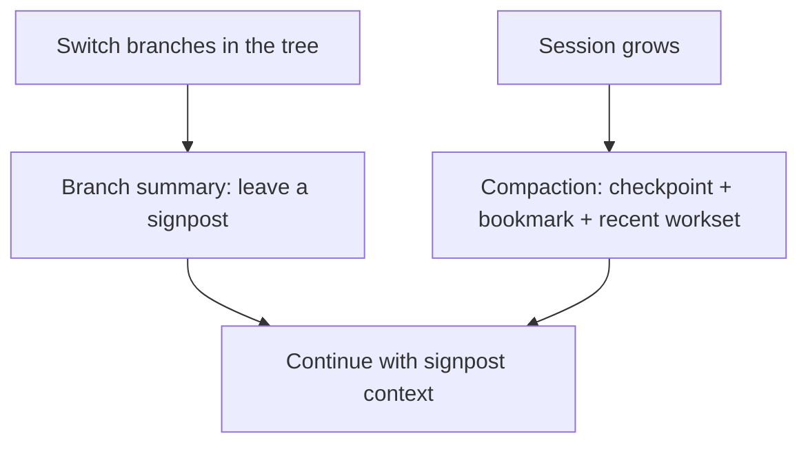

### 开场故事：我没用过 /tree，也能理解它为什么必要

你说你从来没在 agent 里用过 `/tree`，这很正常。

我反而建议先别急着学命令，先理解它解决的“现实问题”：

- 真实开发不是一条路走到黑，而是会不断试错
- 你经常会想：回到某个更早的状态，从另一条思路继续

如果没有会话树，你只能：

- 把所有尝试都堆在一条线里（越堆越吵）
- 或者另开新会话（上下文断裂，之前学到的东西带不走）

`pi-mono` 的做法是把“长会话压缩”和“分支切换”当成一个系统来做——**上下文治理闭环**。

### 核心理念（一句话）

`pi` 把“对话历史”当成一棵树来管理：

> 你可以随时回到过去的某个节点，从那里分叉继续；而你离开一条分支时，会留下一块“路牌”（branch summary），避免下次重复踩坑。

### 术语地图（先读这段）

- **session tree（会话树）**：同一个会话文件里，历史会分叉成多条路线。
- **leaf（当前指针）**：你现在所在的那条路线的末端。
- **/tree（树导航）**：把“当前指针”移动到树上任意节点，从那里继续聊（就会产生新分支）。
- **branch summary（分支摘要/路牌）**：当你离开某条分支时，把这条分支的“试过什么、为什么不行、下一步建议”总结成一段可携带经验。
- **compaction（压缩/总结页+书签）**：解决“会话太长装不下”的容量问题。

### 方案总览：为什么这是一个闭环

一句话：

- **compaction** 解决容量问题
- **branch summary** 解决“探索经验可迁移”问题
- 两者合起来，才是“长期可用”的上下文系统

### 为什么需要 session tree？线性历史不行吗？

### 它是什么

session tree 就是：

- 你可以在任意历史点继续
- 继续之后会产生新分支
- 旧分支不丢失

### 为什么需要

因为真实开发不是一条线：你会试错、回滚、对比方案。

线性历史只能给你两个选择：

- 把错误尝试全部混在一起（噪音越来越大）
- 另开新会话（上下文断裂）

树结构让你可以“同一项目、同一上下文宇宙”里做多条探索。

### 怎么决定

实现上就是给每条 entry 一个 `id` 和 `parentId`，天然形成树。

### 错了会怎样

没有树，你就很难做“可控试错”：要么丢上下文，要么上下文被噪音淹没。

### /tree 切换时，最致命的问题是什么？

不是“我能不能跳过去”，而是：

> 我离开这条分支时学到的东西，怎么不丢？

这就是 branch summary 存在的原因。

### branch summary（路牌）到底是什么？

### 它是什么

当你从分支 A 跳去分支 B：

- pi 会找出你离开的那段分支内容
- 把它总结成一段结构化摘要
- 把这段摘要作为一个 `branch_summary` entry 插回树上

它不是“为了存档”，而是为了**把探索经验变成可携带上下文**。

### 为什么需要

因为分支 A 往往是“试错分支”。它的价值不是结果，而是：

- 哪些路走不通
- 为什么走不通
- 你已经验证过什么

如果不把这些信息变成路牌，你切换分支后就会重复踩坑。

### 怎么决定（如何知道要总结哪段）

关键步骤是：找共同祖先。

你可以把它想成两条路的最近交叉路口：

- 从旧 leaf 往上爬
- 从新目标节点往上爬
- 找到最深的交汇点 = common ancestor

然后：

- old leaf 到 common ancestor 这段，就是“你离开的那条分支”

源码里就是：

- 收集旧分支 path
- 在目标 path 里从后往前找第一个交集节点

（实现见 `branch-summarization.ts` 的 `collectEntriesForBranchSummary()`）

### 错了会怎样

- 共同祖先找错：你会总结错内容（路牌立错路口）
- 总结范围过大：路牌太长没人看
- 总结范围过小：关键信息没带走

### 路牌内容应该写什么？

`pi` 的路牌不是随便写段“我做了很多事情”。它用结构化格式，让路牌真的可用：

- Goal
- Progress（Done / In Progress / Blocked）
- Key Decisions
- Next Steps

并且它还会把“读过/改过哪些文件”附在后面。

你可以把这理解成：

- 路牌上写“这条路通往哪里/走过什么/为什么不走/接下来怎么走”
- 还贴了一张“我在这条路上动过哪些文件”的清单

### 容量控制：为什么 branch summary 也要考虑 token budget

### 它是什么

分支可能也很长，所以 branch summary 也会有“最多带多少上下文”预算。

### 为什么需要

不然你立的路牌比路还长，回头看路牌又溢出。

### 怎么决定

- 从最新往回取消息
- 超预算就停
- 但会尽量保留已有的 summary 节点（因为它们信息密度高）

### 错了会怎样

- 只取最新：可能丢掉“为什么失败”的关键原因
- 取太多：总结慢、贵，还可能影响后续上下文

### compaction vs branch summary：两者边界怎么划

把它讲成人话：

- **compaction**：桌面太乱装不下了 → 把旧纸整理成总结页 + 书签
- **branch summary**：你换了一条路走 → 在路口立路牌

一个是容量治理，一个是探索治理。

### 落地建议：如果你要实现自己的“上下文治理闭环”

你可以按下面顺序做（不需要一步到位）：

- 先实现会话树（id/parentId）
- 再实现 /tree 跳转（移动当前指针）
- 再加 branch summary（离开分支时立路牌）
- 最后加 compaction（长会话的总结页 + 书签）

并且一定记住：

- 路牌要结构化
- 路牌要短、可扫读
- 路牌要能告诉你“错了会怎样 / 为什么不走那条路”

### 失败模式（错了会怎样）

- 切分支后重复踩坑 → 没有 branch summary 或路牌信息不够
- 切分支后上下文被噪音淹没 → 没有 tree，只能线性堆叠
- 会话越聊越慢、越聊越炸 → 没有 compaction 或压缩不稳定

### 三句话总结

- session tree 让你能在同一会话里试错和对比方案。
- branch summary 像路牌，把“试错分支的经验”变成可携带上下文。
- compaction 管容量，branch summary 管探索，两者合起来才是长期可用的上下文治理系统。

### 附录：关键源码路径（想深挖再看）

- `packages/coding-agent/src/core/compaction/branch-summarization.ts`
- `packages/coding-agent/src/core/session-manager.ts`
- `packages/coding-agent/src/core/extensions/types.ts`
- `packages/coding-agent/src/core/compaction/compaction.ts`
