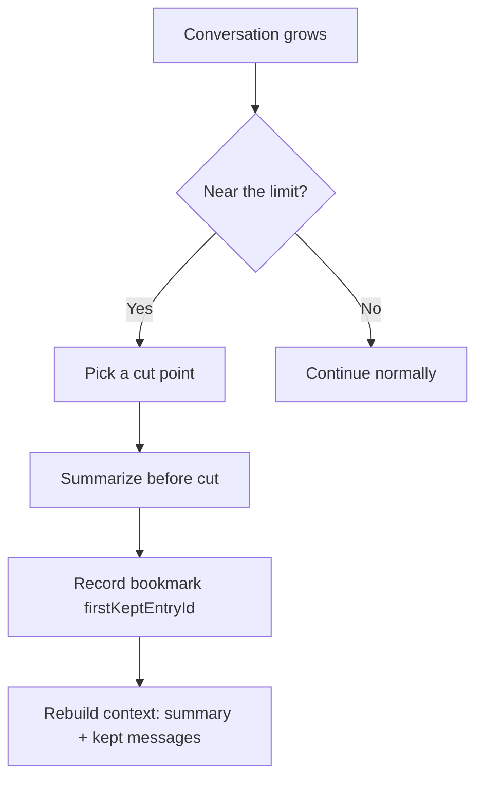

### 开场故事：Agent 为什么会“越干越忘事”？

想象你在写作业：桌上摊着一堆草稿纸。你一边算题一边翻旧纸，很快桌面就满了。

有两种糟糕的结局：

- 纸太多，你找不到关键步骤（= 上下文溢出 / overflow）
- 你把旧纸都扔了，结果忘了你刚刚算到哪一步（= 粗暴截断导致失忆）

`pi-mono` 的 compaction 不是为了“省纸”，而是为了：

> 即使必须收拾桌面，也要让你能继续把题做完。

### 核心理念（一句话）

`pi` 把长会话变成：

> 一张“总结页” + 一张“书签” + 书签后面那几页原稿。

总结页让你知道到目前为止发生了什么；书签告诉你从哪继续看；后面几页保留了最近的细节。

### 术语地图（先读这段）

只要把这四个词搞懂，后面就很轻松。

- **turn（一轮）**：你说一句话 → Agent 回答（可能还会调用工具）→ 这一整段算一轮。
- **cut point（切点）**：决定“从哪里开始保留原始内容”的分界线。
- **firstKeptEntryId（书签）**：切点对应的那条记录 id；压缩后从这条开始继续喂给模型。
- **split turn（一轮被切开）**：某一轮太长，切点落在这一轮中间。

### 方案总览：压缩发生时，系统到底做了什么？



一句话：

- **老内容变“总结页”**，**新内容从“书签”继续**。

### 为什么一定要“切”？不切会怎样？

### 它是什么

切，就是把历史分成两段：

- 前段：压成总结页
- 后段：原样保留（最近的工作集）

### 为什么需要

因为模型像一个容量有限的背包：

- 不切：背包迟早爆
- 乱扔：丢掉关键步骤，做题做一半就断片

### 怎么决定（依据是什么）

`pi` 用一个很直观的规则：

- 我至少要保留最近 `keepRecentTokens` 这么多内容
- 所以从最新往回数，数够了就在那里附近找一个“合法切点”

合法切点的核心约束只有一个：

> **不能切在 toolResult 上。**

原因也很直觉：你不能只留下“答案”，却把“题目”切掉。

关键代码（`compaction.ts`）：

```ts
case "toolResult":
  break; // 禁止切在 toolResult
```

### 错了会怎样

- 切在 toolResult：模型看到工具输出，但不知道调用了什么工具、参数是什么 → 推理会歪。

### 什么算一轮 turn？为什么会出现 split turn？

### 它是什么

一个最小示例：

- User：帮我重构这个函数
- Assistant：好的，我先读文件
- Assistant toolCall：read(path=...)
- toolResult：文件内容
- Assistant：我准备改动，先解释思路

这一整串，从 user 开始到 assistant 收尾，就是一轮。

### 为什么需要

因为“同一轮”内部的内容是强绑定的：读文件、改文件、解释原因都在一起。

### 怎么决定 split turn

当“某一轮”本身就太长（比如工具输出超长、思考很长），即使你只想保留最近 `keepRecentTokens`，切点也可能落在这一轮中间。

这就叫 split turn。

### 错了会怎样

把 split turn 当普通切法处理，会出现：

- 后半轮还在，但前半轮关键背景没了 → 看起来像 Agent 突然变笨。

`pi` 的做法是：

- 对“旧历史”生成一个总结
- 对“这一轮被切掉的前半段”再生成一个小总结
- 两个合并，保证后半段看得懂

关键代码（`compaction.ts`）：

```ts
const [historyResult, turnPrefixResult] = await Promise.all([
  generateSummary(...),
  generateTurnPrefixSummary(...),
]);
```

### `firstKeptEntryId`（书签）到底是什么？

### 它是什么

它就是书签：告诉系统“从哪条记录开始，把原文接回去”。

### 为什么需要

没有书签，你不知道总结页之后应该接哪几页原稿。

### 怎么决定

- `findCutPoint()` 找到切点位置
- 对应 entry 的 `id` 就是 `firstKeptEntryId`

### 错了会怎样

- 书签偏后：丢上下文
- 书签偏前：重复上下文

重建上下文时（`session-manager.ts`）做的事可以翻译成人话：

- 先把“总结页”放进背包
- 再从“书签”开始把原文一页页塞进背包

### 为什么压缩后还能记得“动过哪些文件”？

这件事是 compaction 能落到工程场景的关键。

`pi` 会把工具调用里涉及的文件路径记下来：

- read 过哪些
- write/edit 过哪些

这样压缩后，你依然知道“我刚刚动过哪几个文件”。

关键代码（`utils.ts`）：

```ts
case "read": fileOps.read.add(path);
case "write": fileOps.written.add(path);
case "edit": fileOps.edited.add(path);
```

最后把它们写进总结页尾部（读者不需要懂 XML，理解成“附录清单”即可）。

### overflow vs threshold：什么时候自动压缩？

把它讲成初中生能懂的版本：

- **overflow**：背包已经爆了 → 先把坏掉那页（error message）拿出来 → 立刻收拾桌面 → 再继续做题
- **threshold**：背包快满了但还没爆 → 先收拾桌面，但不强行继续，等你下一句再说

这里 `reserveTokens` 的直觉是：

- 给“下一次回答”留出呼吸空间

### 落地建议（今天就能用）

如果你自己做 Agent 上下文治理，建议优先抄这四条：

- 把 compaction 当“状态恢复”，不是当“省 token”
- cut point 禁止切在 toolResult
- split turn 要兜底（否则最容易断片）
- 记录文件轨迹（至少路径级别）

参数起步：

```json
{
  "compaction": {
    "enabled": true,
    "reserveTokens": 20000,
    "keepRecentTokens": 28000
  }
}
```

### 失败模式（错了会怎样）

你可以用这张清单快速定位“压缩没写好”的症状：

- 压缩后 Agent 不知道刚改过哪些文件 → 文件轨迹没保住
- 压缩后工具相关推理全乱 → cut point 切断了 tool 语义
- 压缩后突然变笨，像失忆 → split turn 没兜住 / 总结页缺关键桥接

### 三句话总结

- compaction 的目标不是省 token，而是让 Agent **压缩后还能继续干活**。
- `firstKeptEntryId` 就是书签：总结页之后从哪继续接原文。
- cut point/split turn/file 轨迹，是“工程可继续性”的三件套。

### 附录：关键源码路径（想深挖再看）

- `packages/coding-agent/src/core/compaction/compaction.ts`
- `packages/coding-agent/src/core/compaction/utils.ts`
- `packages/coding-agent/src/core/agent-session.ts`
- `packages/coding-agent/src/core/session-manager.ts`
