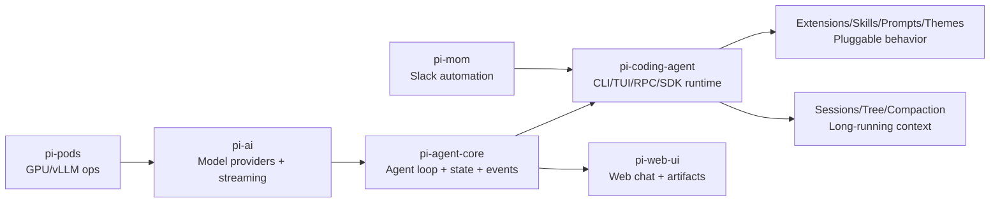

> 一句话摘要：`pi` 不是“又一个 Agent SDK”，它更像一套可扩展的 *agent runtime*。你可以把它当作“会自己长出工作流”的终端操作系统。

### 开场故事：为什么很多 Agent demo 到生产就死了？

你应该见过这种场景：

- Demo 时：能对话、能调工具、能写点代码。
- 真干活：任务一复杂，就开始崩——上下文爆、工具链断、UI 不稳定、扩展难维护。

问题往往不是模型不够强，而是“运行时”不够强。

`pi-mono` 给我的最大感觉是：它不是在卖一堆 feature，而是在补齐 agent 从 demo 走向日常工程的底座。

### 核心理念（一句话）

`pi` 真正优化的不是“回答质量”，而是：

> 让 agent 在长任务、试错、切换分支、切换模型的情况下，依然能稳定推进工作。

### 术语地图（先读这段）

- **runtime（运行时）**：不只是调用模型，而是包含会话、工具、UI、扩展、重试、压缩、持久化的一整套机制。
- **event stream（事件流）**：所有交互（文本增量、工具调用、结果、状态变化）都走统一事件模型。
- **extension（扩展）**：不是“加几个工具函数”，而是能在关键生命周期上改行为。
- **compaction（压缩）**：把长会话做成“总结页 + 书签 + 最近工作集”，保证可继续。
- **tree（会话树）**：允许在同一会话里分叉试错，离开分支时用 branch summary 留路牌。

### 方案总览：pi-mono 的分层长什么样

一句话：

- `pi-ai` 负责“怎么跟模型说话”
- `pi-agent-core` 负责“agent 怎么循环工作”
- `pi-coding-agent` 把它们变成“能长期使用的产品运行时”

### 关键机制：为什么我说它是 runtime，而不是 SDK

### 它是什么

很多 SDK 只给你一个 `client.chat.completions.create()` + tools 接口。`pi` 多做了三件对生产极其重要的事：

- 会话持久化（JSONL + tree）
- 上下文治理（compaction + branch summary）
- 可编排扩展（生命周期 hook + UI 注入 + provider 注册）

### 为什么需要

因为真实工作流要面对：

- 长任务（上下文一定会爆）
- 试错（一定会回到过去改路）
- 团队定制（一定会想加权限、加流程、加内部工具）

如果这些都靠“在业务代码里自己拼”，维护会很痛。

### 怎么决定（pi 的取舍）

`pi` 明确偏向：

- 核心尽量小
- 复杂能力通过扩展/包外置

### 错了会怎样

如果你把“长期能力”硬塞进核心：

- 内核膨胀，升级困难
- 每个团队都得 fork
- 生态难形成

### 关键机制：pi-ai 的统一到底“统一到哪里”

### 它是什么

`pi-ai` 不只是把不同 provider 的请求参数抹平，它更关注：

- 流式文本增量（text delta）
- 工具调用增量（toolcall delta）
- thinking / reasoning block
- usage/cost

### 为什么需要

UI（TUI/Web）想要稳定，必须建立在稳定事件语义上：

- “我现在看到的是 token 增量还是工具参数增量？”
- “这次 stop reason 到底是什么？”

### 怎么决定

在很多实现里，tool call 只有结束时给你一坨 JSON。`pi-ai` 把“增量”当一等公民，便于 UI 即时显示。

### 错了会怎样

事件语义不统一会导致：

- 不同 provider 行为不一致
- UI 逻辑复杂
- debug 很痛

### 关键机制：pi-agent-core 的事件化 agent loop

### 它是什么

`pi-agent-core` 把 agent 循环变成“可订阅的状态机”。你不需要在业务逻辑里到处插 logging/UI。

### 为什么需要

因为你希望：

- 同一套 agent loop 能在 CLI、TUI、RPC、Web 复用
- 可以回放、可审计、可重试

### 怎么决定

所有关键状态通过 event stream 抛出：turn start/end、message update、tool execution 等。

### 错了会怎样

没有事件化：

- UI 必须耦合业务
- 复用成本高
- 很难做稳定的中间层能力（重试/压缩/树导航）

### 关键机制：上下文治理（为什么 pi 的 compaction/tree 很关键）

这块你已经看过两篇：

- `docs/clawbot/pi 上下文压缩.md`
- `docs/clawbot/pi 上下文 tree.md`

这里我只说它在“产品层”的意义：

- **compaction**：保证长会话能继续干
- **tree + branch summary**：保证试错经验不会丢

这两者合起来，才像一个能长期使用的“工作台”，而不是一次性对话。

### 关键机制：扩展系统为什么是护城河

### 它是什么

`extensions/types.ts` 暴露的不是“插件点”，而是“可以动内脏的编排能力”。例如：

- `session_before_compact`：接管压缩策略
- `session_before_tree`：接管分支摘要/导航
- `before_agent_start` / `context`：改输入、改 prompt、改 messages
- 工具调用前后 hook：审计、权限、策略

### 为什么需要

团队真实需求经常是：

- 加权限门禁（哪些命令/工具能用）
- 加工作流（比如必须先跑测试再提交）
- 接入内部 provider

### 怎么决定

pi 选择把这些能力“接口化”，让核心保持 minimal。

### 错了会怎样

如果扩展只停留在“注册工具函数”：

- 你很难做组织级工作流
- 最后还是走向 fork

### 落地建议（今天就能用）

如果你要抄 `pi` 的思想（而不是抄代码），我建议抄这 5 条：

- 先把 agent 做成事件流（UI/日志/回放统一）
- 把长会话治理当 runtime 功能（compaction + 书签）
- 把试错当常态（tree + 离开分支留路牌）
- 把扩展做成“能改行为”的接口，不只是 tools
- 保持 core 小，把多样性放到包生态

### 失败模式（错了会怎样）

你会在这些症状里看到“是不是缺 runtime”：

- 一长就 overflow → 没有 compaction/checkpoint
- 一试错就重复踩坑 → 没有 tree/branch summary
- 一定制就 fork → 扩展点不够深
- 一换 provider UI 就崩 → 没有统一事件语义

### 三句话总结

- `pi` 的价值不在“功能多”，在“长期可用的运行时”。
- 它用事件流把模型、工具、UI 解耦，用 compaction/tree 管好长期上下文。
- 扩展系统足够深，才让它适合团队把工作流长在上面。

### 附录：关键源码路径（想深挖再看）

- `pi-ai`：`packages/ai/README.md`
- `pi-agent-core`：`packages/agent/README.md`
- `pi-coding-agent`：`packages/coding-agent/src/core/agent-session.ts`
- compaction：`packages/coding-agent/src/core/compaction/compaction.ts`
- tree/branch summary：`packages/coding-agent/src/core/compaction/branch-summarization.ts`
- extensions：`packages/coding-agent/src/core/extensions/types.ts`
