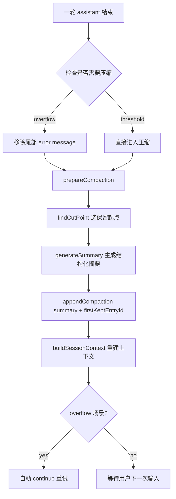

### 这篇文章先回答一个现实问题

如果你把 AI Coding Agent 真放进日常开发，很快会遇到这三种崩溃：

- 会话越聊越长，突然上下文溢出，回答直接报错
- 为了省 token 粗暴截断后，模型忘了“刚改过哪些文件”
- 复杂任务一半在旧上下文、一半在新上下文，后续续不上

`pi-mono` 的 compaction 解决的不是“省一点 token”，而是：

> 在上下文不得不压缩时，依然让 Agent 保持“可恢复的工作状态”。

这才是它真正有价值的地方。

### 核心理念（一句话）

`pi` 的压缩策略本质是 **checkpoint 化上下文**：

- 不直接删除历史
- 追加一条结构化 `compaction` 记录作为“新的上下文入口”
- 保留一段最近消息继续运行

所以它更像数据库里的“检查点 + 增量日志”，不是简单聊天截断。

### 方案总览



一句话看懂：

- 压缩不是删对话，而是“把旧历史折叠成摘要 checkpoint，再接上最近工作集”。

### 关键机制：触发策略（overflow vs threshold）

先回答问题：**为什么要区分两种触发？**

因为“已经爆了”和“快爆了”需要不同恢复策略。

- overflow：已经报错，要压缩后自动续跑
- threshold：预防性压缩，不自动继续

关键代码（`agent-session.ts`）：

```ts
if (sameModel && !errorIsFromBeforeCompaction && isContextOverflow(...)) {
  const messages = this.agent.state.messages;
  if (messages.length > 0 && messages[messages.length - 1].role === "assistant") {
    this.agent.replaceMessages(messages.slice(0, -1));
  }
  await this._runAutoCompaction("overflow", true);
  return;
}

const contextTokens = calculateContextTokens(assistantMessage.usage);
if (shouldCompact(contextTokens, contextWindow, settings)) {
  await this._runAutoCompaction("threshold", false);
}
```

这段代码你要记住三件事：

- 解决了：把“报错恢复”与“预防压缩”拆开，行为更可控。
- 代价是：状态机分支变复杂，需要避免重复触发。
- 坑点是：模型切换场景要防误触发（源码里有 `sameModel` 判断）。

### 关键机制：token 估算（为什么不全靠 heuristic）

先回答问题：**上下文大小怎么算才靠谱？**

`pi` 的做法很务实：

- 优先用最后一条 assistant usage（真实计量）
- 仅对 trailing messages 用 `chars/4` 估算

关键代码（`compaction.ts`）：

```ts
const usageTokens = calculateContextTokens(usageInfo.usage);
let trailingTokens = 0;
for (let i = usageInfo.index + 1; i < messages.length; i++) {
  trailingTokens += estimateTokens(messages[i]);
}

return {
  tokens: usageTokens + trailingTokens,
  usageTokens,
  trailingTokens,
  lastUsageIndex: usageInfo.index,
};
```

这段代码你要记住三件事：

- 解决了：纯 heuristic 在长会话误差累积的问题。
- 代价是：依赖 provider usage 质量；无 usage 时仍需 fallback。
- 坑点是：不同模型/provider usage 字段差异，需要统一适配层。

### 关键机制：cut point（为什么不能切在 toolResult）

先回答问题：**压缩从哪切，才能不破坏语义？**

`pi` 的核心约束：

- 可以切 user / assistant / custom / bashExecution
- 不能切 `toolResult`

因为 `toolResult` 必须和前面的 toolCall 保持关联，切断后模型会看到“结果”但不知道“调用了什么”。

关键代码（`compaction.ts`）：

```ts
switch (role) {
  case "bashExecution":
  case "custom":
  case "branchSummary":
  case "compactionSummary":
  case "user":
  case "assistant":
    cutPoints.push(i);
    break;
  case "toolResult":
    break;
}
```

这段代码你要记住三件事：

- 解决了：压缩后工具语义错位（最常见灾难之一）。
- 代价是：可切点减少，可能更早触发 split-turn。
- 坑点是：自定义消息类型要清楚是否允许作为 cut point。

### 关键机制：split turn（单轮过大时怎么保住上下文）

先回答问题：**如果一个 turn 本身就超大怎么办？**

这时 cut 可能落在 turn 中间。`pi` 不硬切，而是双摘要：

- history summary
- turn prefix summary

并行生成后合并。

关键代码（`compaction.ts`）：

```ts
if (isSplitTurn && turnPrefixMessages.length > 0) {
  const [historyResult, turnPrefixResult] = await Promise.all([
    generateSummary(...),
    generateTurnPrefixSummary(...),
  ]);
  summary = `${historyResult}\n\n---\n\n**Turn Context (split turn):**\n\n${turnPrefixResult}`;
}
```

这段代码你要记住三件事：

- 解决了：复杂单轮任务在压缩后无法续写的问题。
- 代价是：多一次 LLM 总结调用，延迟和成本上升。
- 坑点是：摘要质量不稳定时，turn 语义桥接会退化。

### 关键机制：为什么压缩后还能“记得改了哪些文件”

先回答问题：**摘要后工程上下文怎么保真？**

`pi` 会从 assistant toolCalls 里抽取 `read/write/edit(path)`，并累计到摘要尾部。

关键代码（`utils.ts`）：

```ts
switch (block.name) {
  case "read":
    fileOps.read.add(path);
    break;
  case "write":
    fileOps.written.add(path);
    break;
  case "edit":
    fileOps.edited.add(path);
    break;
}
```

最后会追加：

```xml
<read-files>
...
</read-files>

<modified-files>
...
</modified-files>
```

这段机制你要记住三件事：

- 解决了：压缩后“我到底动过什么文件”丢失问题。
- 代价是：只能追踪走 tool 层的文件操作。
- 坑点是：如果扩展绕过标准 read/write/edit 工具，轨迹会不完整。

### 关键机制：压缩后如何重建给 LLM 的上下文

先回答问题：**summary 写进 session 后，模型具体看到什么？**

在 `session-manager.ts`：

- 先注入 `compactionSummaryMessage`
- 再从 `firstKeptEntryId` 开始拼接保留消息
- 最后接 compaction 之后的新消息

关键代码：

```ts
messages.push(createCompactionSummaryMessage(...));
// emit kept messages from firstKeptEntryId
// emit messages after compaction
```

这段机制你要记住三件事：

- 解决了：压缩后上下文入口不稳定的问题。
- 代价是：摘要成为高权重事实层，质量要求很高。
- 坑点是：firstKeptEntryId 选错会导致上下文断层。

### 扩展能力：compaction 不是黑盒，可被接管

先回答问题：**能不能换我自己的压缩策略？**

可以，`session_before_compact` 事件允许 extension：

- cancel 默认压缩
- 回传自定义 `CompactionResult`

接口（`extensions/types.ts`）里有：

- `preparation.messagesToSummarize`
- `preparation.turnPrefixMessages`
- `preparation.previousSummary`
- `preparation.firstKeptEntryId`

官方示例 `examples/extensions/custom-compaction.ts` 还演示了“用另一个模型做摘要”。

### 落地建议（今天就能用）

如果你要把这套思想迁移到自己的 Agent：

- 不要先做 fancy memory，先做 checkpoint 语义
- cut point 一定禁止切在 tool result
- overflow 与 threshold 分路径处理
- 保留文件操作轨迹（哪怕先只做 read/edit/write path）

参数建议（起步）：

```json
{
  "compaction": {
    "enabled": true,
    "reserveTokens": 20000,
    "keepRecentTokens": 28000
  }
}
```

当你发现“压缩后仍频繁 overflow”，优先调大 `reserveTokens`；
当你发现“压缩后上下文接不上”，优先调大 `keepRecentTokens`。

### 边界与反模式

这套方案也有边界：

- 摘要质量本质受模型影响，无法 100% 无损
- 文件轨迹只能覆盖标准工具调用
- 若过度压缩，会把细节债务推给后续轮次

常见反模式：

- 把 compaction 当成本优化手段，而不是状态恢复手段
- 只做摘要，不做结构化字段（Goal/Next Steps/Critical Context）
- 不追踪文件操作，导致 coding 场景恢复失败

### 总结：你应该记住的三句话

- `pi` 的上下文压缩本质是“可恢复工作状态”，不是“减少 token 消耗”。
- 它通过 `summary checkpoint + firstKeptEntryId` 重建上下文，而不是粗暴截断历史。
- 真正让它可用于工程场景的，是 cut 约束、split-turn 兜底、文件轨迹累计、扩展可接管。

### 附录：关键源码索引

- `packages/coding-agent/src/core/agent-session.ts`
- `packages/coding-agent/src/core/compaction/compaction.ts`
- `packages/coding-agent/src/core/compaction/utils.ts`
- `packages/coding-agent/src/core/session-manager.ts`
- `packages/coding-agent/src/core/extensions/types.ts`
- `packages/coding-agent/examples/extensions/custom-compaction.ts`
