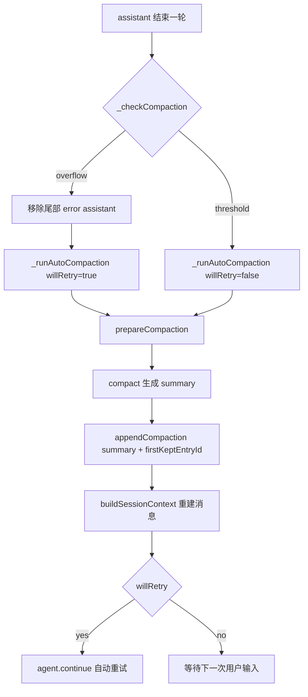

### 这篇文章要解决什么问题

你关心的是：`pi` 的上下文压缩（compaction）到底怎么实现，为什么它在长会话里还能保持可继续性。

这篇不做概念科普，直接走源码路径，覆盖：

- 触发机制（overflow vs threshold）
- cut point 算法与 split turn
- 摘要生成 prompt 设计
- 文件操作轨迹是怎么累计进去的
- 压缩后会话如何重建
- 扩展如何接管 compaction

核心代码位于：

- `packages/coding-agent/src/core/agent-session.ts`
- `packages/coding-agent/src/core/compaction/compaction.ts`
- `packages/coding-agent/src/core/compaction/utils.ts`
- `packages/coding-agent/src/core/session-manager.ts`
- `packages/coding-agent/src/core/extensions/types.ts`

### 先建立心智模型：pi 的 compaction 不是“删历史”，而是“重写上下文入口”

很多系统压缩上下文是“直接删旧消息”，pi 不是。它做的是：

- 在 session tree 里追加一条 `compaction` entry
- `compaction` entry 存 summary + `firstKeptEntryId`
- 重新构建给 LLM 的上下文时：
  - 先喂这条 summary
  - 再喂从 `firstKeptEntryId` 开始的“保留消息”

这意味着“完整历史仍在 JSONL 里”，只是上下文窗口入口换成了 checkpoint。



### 触发机制：两类触发路径，行为不同

在 `agent-session.ts` 的 `_checkCompaction()`，压缩有两个入口：

### overflow：模型已经报上下文溢出

逻辑关键点：

- 只有“当前选中模型”的 overflow 才触发（防止模型切换误触发）
- 如果 error 发生在某次 compaction 之前，也不会重复触发
- 触发后会先从 agent state 移除最后一个 error assistant message
- 然后 auto compact，并 `willRetry=true`

```ts
if (sameModel && !errorIsFromBeforeCompaction && isContextOverflow(...)) {
  const messages = this.agent.state.messages;
  if (messages.length > 0 && messages[messages.length - 1].role === "assistant") {
    this.agent.replaceMessages(messages.slice(0, -1));
  }
  await this._runAutoCompaction("overflow", true);
  return;
}
```

这个设计的意义很实用：避免“错误消息本身”污染下一次重试上下文。

### threshold：还没爆，但接近上限

在 assistant 成功返回后，基于 usage 计算当前上下文 token，超过阈值就压缩，但不会自动继续回答。

```ts
const contextTokens = calculateContextTokens(assistantMessage.usage);
if (shouldCompact(contextTokens, contextWindow, settings)) {
  await this._runAutoCompaction("threshold", false);
}
```

`shouldCompact` 非常直接：

```ts
contextTokens > contextWindow - reserveTokens
```

默认配置（`settings-manager.ts`）：

- `reserveTokens = 16384`
- `keepRecentTokens = 20000`
- `enabled = true`

### token 估算策略：优先可信 usage，fallback 才走估算

`estimateContextTokens()` 的策略很值得学：

- 先找最后一条有 usage 的 assistant message
- 用它的 `totalTokens`（或 input/output/cacheRead/cacheWrite 求和）作为可信基线
- 只对其后的 trailing messages 做启发式估算（chars/4）

```ts
return {
  tokens: usageTokens + trailingTokens,
  usageTokens,
  trailingTokens,
  lastUsageIndex: usageInfo.index,
};
```

这比“全量 chars/4”稳定很多，尤其在长会话里误差不会累积爆炸。

### cut point 算法：保证工具调用语义不被切断

压缩真正难点不是“何时压缩”，而是“从哪里切”。

`findCutPoint()` 的约束：

- 允许切在 `user / assistant / custom / bashExecution / branchSummary / compactionSummary`
- **禁止切在 `toolResult`**（避免 tool call 和结果分离）
- 从最新往前累计 token，达到 `keepRecentTokens` 后找最近有效切点
- 再向前吸纳非 message entry（模型切换、thinking 变更等）

```ts
if (entry.type === "message") {
  const role = entry.message.role;
  if (role === "toolResult") {
    // never cut here
  }
}
```

这个细节很关键：很多系统压缩后会出现“模型看到 tool result 但看不到 tool call”，导致后续推理错位。pi 在 cut rules 层避免了这类坏状态。

### split turn：单轮过大时的双摘要策略

如果单个 turn 本身就很大，cut 可能落在 turn 中间。pi 会识别 `isSplitTurn`，并把摘要拆成两块并行生成：

- history summary（旧历史）
- turn prefix summary（当前大 turn 的前缀）

```ts
if (isSplitTurn && turnPrefixMessages.length > 0) {
  const [historyResult, turnPrefixResult] = await Promise.all([
    generateSummary(...),
    generateTurnPrefixSummary(...),
  ]);
  summary = `${historyResult}\n\n---\n\n**Turn Context (split turn):**\n\n${turnPrefixResult}`;
}
```

这就是为什么 pi 在“单次复杂任务、工具调用巨长”的场景下还能续上语义，而不是只剩抽象总结。

### 摘要 prompt 设计：结构化 checkpoint，而不是自由摘要

`SUMMARIZATION_PROMPT` 明确要求固定结构：

- Goal
- Constraints & Preferences
- Progress（Done / In Progress / Blocked）
- Key Decisions
- Next Steps
- Critical Context

并强调保留：

- 文件路径
- 函数名
- error message

同时，`generateSummary()` 会把消息先 `convertToLlm()`，再 `serializeConversation()` 成文本包在 `<conversation>` 标签里，避免模型“继续对话”而不是“总结对话”。

```ts
const llmMessages = convertToLlm(currentMessages);
const conversationText = serializeConversation(llmMessages);
const promptText = `<conversation>\n${conversationText}\n</conversation>\n\n${basePrompt}`;
```

这是个非常工程化的防偏航手法。

### 文件读写轨迹：压缩后仍保留“工程可继续性”

`utils.ts` 里会从 assistant 的 tool calls 抽取 `read/write/edit` 对应 path：

```ts
switch (block.name) {
  case "read": fileOps.read.add(path); break;
  case "write": fileOps.written.add(path); break;
  case "edit": fileOps.edited.add(path); break;
}
```

然后在摘要尾部追加：

```xml
<read-files>
...
</read-files>

<modified-files>
...
</modified-files>
```

并且它会把“前一次 compaction details”也合并进来，实现累计追踪。这点对 coding task 非常重要：你换模型、跨分支后仍然知道哪些文件被读过改过。

### 压缩后怎么重建上下文：session-manager 的关键拼接

`buildSessionContext()` 在检测到 `compaction` entry 后，组装顺序是：

- `createCompactionSummaryMessage(compaction.summary, ...)`
- 从 `firstKeptEntryId` 到 compaction 前的 kept entries
- compaction 后的新消息

```ts
messages.push(createCompactionSummaryMessage(...));
// kept messages from firstKeptEntryId
// messages after compaction
```

这相当于把原始超长历史折叠成“一个稳定摘要节点 + 最近工作集”。

### 扩展接管：compaction 在 pi 里是可编排能力

在 `extensions/types.ts`，`session_before_compact` 可以：

- cancel 默认压缩
- 返回自定义 `compaction` 结果

```ts
interface SessionBeforeCompactEvent {
  type: "session_before_compact";
  preparation: CompactionPreparation;
  branchEntries: SessionEntry[];
  customInstructions?: string;
  signal: AbortSignal;
}
```

官方示例 `examples/extensions/custom-compaction.ts` 演示了：

- 用另一模型（Gemini Flash）做摘要
- 汇总 `messagesToSummarize + turnPrefixMessages`
- 回传自定义 summary

这使 compaction 从“内部策略”变成“可插拔策略接口”。

### 一个更底层的 tradeoff：为什么是 keepRecentTokens，而不是 keepRecentTurns

pi 当前以 token 预算裁切（`keepRecentTokens`），而不是固定 N turn。优点：

- 对工具输出超长的 turn 更稳
- 更贴近真实 context window 约束

代价：

- 同样的任务，不同消息密度下保留 turn 数会波动
- 需要 split-turn 机制兜底（pi 已实现）

这是偏“系统工程正确性”的取舍，而不是“交互上看起来整齐”的取舍。

### 你可以直接用的调参建议（基于这套实现）

如果你在 OpenClaw/自有 agent 里借鉴这套策略：

- 高频工具调用项目：`keepRecentTokens` 适当提高，减少 split-turn 发生概率
- 输出较长模型：`reserveTokens` 提高，避免刚压缩完又 overflow
- 若希望更可控摘要质量：用 extension 接管 `session_before_compact`，专门指定摘要模型

一个可参考的配置：

```json
{
  "compaction": {
    "enabled": true,
    "reserveTokens": 20000,
    "keepRecentTokens": 28000
  }
}
```

### 最后结论：pi 的 compaction 强在“可恢复语义”，不是“省 token”

表面看它是在省 context，实际上它在做的是 **可恢复执行状态管理**：

- 有结构化 checkpoint
- 有 turn 级边界保护
- 有 split-turn 兜底
- 有文件操作轨迹累计
- 有扩展层可接管

所以它比“简单摘要 + 截断”更接近可生产化的 agent runtime。

### 附：关键源码阅读路径

```text
packages/coding-agent/src/core/agent-session.ts
packages/coding-agent/src/core/compaction/compaction.ts
packages/coding-agent/src/core/compaction/utils.ts
packages/coding-agent/src/core/compaction/branch-summarization.ts
packages/coding-agent/src/core/session-manager.ts
packages/coding-agent/src/core/extensions/types.ts
packages/coding-agent/examples/extensions/custom-compaction.ts
packages/coding-agent/docs/compaction.md
```
