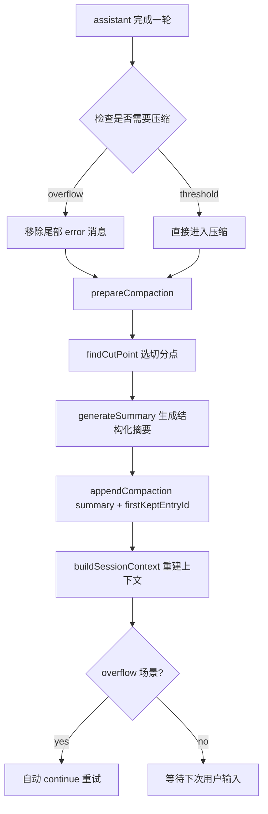

### 开场故事：一次“看起来没问题”的长会话，为什么突然崩了？

我第一次认真意识到上下文压缩的重要性，不是在 benchmark，而是在一次很普通的重构任务里。

当时 Agent 已经连续工作了几十轮：读了很多文件、改了不少逻辑、跑了几次命令。表面一切正常。直到某一轮，模型突然报上下文溢出。更糟的是，换个模型继续后，回答开始“失忆”——它记得目标，却说不清刚改过哪些文件、为什么这么改。

这类事故的本质不是“token 不够”，而是“工作状态断裂”。

`pi-mono` 这套 compaction 让我觉得有意思的点就在这：它解决的不是省 token，而是尽量让 Agent 在压缩后仍然“接得上活”。

### 核心理念（一句话）

`pi` 的上下文压缩本质是：

> 把长会话做成“可恢复的检查点 + 最近工作集”，而不是粗暴截断历史。

你可以把它想成一本很厚的技术笔记：

- 压缩摘要 = 目录页 + 关键结论
- `firstKeptEntryId` = 书签
- 书签之后的内容 = 你手边还摊开的那几页

### 术语地图（先读这段）

先把几个关键词讲成人话，后面就不难了。

- **turn（轮次）**：从一次用户输入开始，到模型回复（以及可能的一串工具调用）结束，算一轮。
- **cut point（切分点）**：压缩时决定“从哪里开始保留原消息”的分界线。
- **split turn（轮次被切开）**：某一轮太大，切分点落在这轮中间。
- **firstKeptEntryId（保留起点 ID）**：压缩后重建上下文时的“书签位置”，从这个 entry 开始把原消息接回去。
- **compaction summary（压缩摘要）**：对旧上下文的结构化总结，不是完整历史副本。

### 方案总览：pi 是怎么把“压缩”做成“可恢复”的



这张图你只要记住一句话：

- `pi` 不是“删旧消息”，而是“插入一个 checkpoint，再从书签继续”。

### 为什么要切？不切会怎样？

### 它是什么

“切”就是在超长历史里找一个分界线，把前面压成摘要，把后面原样保留。

### 为什么需要它

如果不切，你只有两个坏选项：

- 全量保留：迟早 overflow
- 粗暴截断：语义断裂，尤其是工具调用链断裂

### 怎么决定它

`pi` 按 token 预算找切分点：从新到旧累加，达到 `keepRecentTokens` 后找到合法 cut point。

### 错了会怎样

切错最典型的后果是：模型看到 tool result，却看不到对应 tool call，后续推理直接跑偏。

关键代码（`compaction.ts`）：

```ts
switch (role) {
  case "bashExecution":
  case "custom":
  case "branchSummary":
  case "compactionSummary":
  case "user":
  case "assistant":
    cutPoints.push(i);
    break;
  case "toolResult":
    break; // 禁止切在 toolResult
}
```

这段代码你要记住三件事：

- 解决了：工具调用语义被切断的问题。
- 代价是：可切位置减少，可能更早进入 split turn。
- 容易踩坑在：自定义消息类型若未分类清楚，切分规则会失真。

### 什么算一个 turn？为什么 split turn 会出现？

### 它是什么

turn 可以理解成“用户提一个任务，Agent完成这一轮处理”的最小语义单元。

### 为什么需要这个概念

因为压缩最怕把“同一轮”硬拆坏。尤其一轮里有长工具输出时，语义耦合很强。

### 怎么决定 split turn

当单轮内容本身太大，超过 `keepRecentTokens`，切分点就可能落在这轮中间，变成 split turn。

### 错了会怎样

如果把 split turn 当普通切分处理，后半轮会丢掉前置上下文，模型表现会像“突然变笨”。

关键代码（`compaction.ts`）：

```ts
if (isSplitTurn && turnPrefixMessages.length > 0) {
  const [historyResult, turnPrefixResult] = await Promise.all([
    generateSummary(...),
    generateTurnPrefixSummary(...),
  ]);
  summary = `${historyResult}\n\n---\n\n**Turn Context (split turn):**\n\n${turnPrefixResult}`;
}
```

这段代码你要记住三件事：

- 解决了：超长单轮被硬切后“接不上”的问题。
- 代价是：多一次摘要调用，延迟和成本上升。
- 容易踩坑在：摘要质量不稳定时，桥接信息不足。

### `firstKeptEntryId` 到底是什么？

### 它是什么

它就是“书签”。告诉系统：压缩后，从哪条原始 entry 开始继续喂给模型。

### 为什么需要它

没有它，summary 之后接哪段历史会变模糊，容易出现上下文重建错位。

### 怎么决定它

由 `findCutPoint()` 决定 `firstKeptEntryIndex`，再映射到对应 entry 的 `id`。

### 错了会怎样

书签错一位，可能导致：

- 重复上下文（模型反复看到同一段）
- 缺失上下文（关键一段被跳过）

重建逻辑（`session-manager.ts`）核心顺序：

```ts
messages.push(createCompactionSummaryMessage(...));
// 从 firstKeptEntryId 开始拼接 kept messages
// 再拼 compaction 之后的新消息
```

这段代码你要记住三件事：

- 解决了：压缩后上下文入口不稳定的问题。
- 代价是：summary 成为高权重事实层。
- 容易踩坑在：firstKeptEntryId 计算或存储异常。

### 为什么压缩后还能记得“动过哪些文件”？

`pi` 在摘要时会额外抽取工具调用中的文件路径（read/write/edit），并追加到摘要尾部。

关键代码（`utils.ts`）：

```ts
switch (block.name) {
  case "read": fileOps.read.add(path); break;
  case "write": fileOps.written.add(path); break;
  case "edit": fileOps.edited.add(path); break;
}
```

最终会形成：

```xml
<read-files>
...
</read-files>

<modified-files>
...
</modified-files>
```

这段机制你要记住三件事：

- 解决了：压缩后“工程足迹”丢失的问题。
- 代价是：仅覆盖标准工具调用路径。
- 容易踩坑在：扩展若绕过标准工具，轨迹会不完整。

### 自动触发怎么判断？overflow 和 threshold 有啥区别？

- **overflow**：已经报错，目标是“恢复 + 自动重试”
- **threshold**：还没报错，目标是“预防”，不自动继续

关键判断（`agent-session.ts`）：

```ts
if (shouldCompact(contextTokens, contextWindow, settings)) {
  await this._runAutoCompaction("threshold", false);
}
```

`shouldCompact` 规则很直接：

```ts
contextTokens > contextWindow - reserveTokens
```

你可以把 `reserveTokens` 理解成“给下一次回答预留的呼吸空间”。

### 落地建议（今天就能用）

如果你在自己的 Agent 系统里想借鉴：

- 把“压缩”当状态恢复，不是成本优化
- 先做 cut point 约束（尤其禁止切 toolResult）
- 处理 split turn（不要偷懒）
- 保留文件轨迹（至少 path 级）

参数起步建议：

```json
{
  "compaction": {
    "enabled": true,
    "reserveTokens": 20000,
    "keepRecentTokens": 28000
  }
}
```

调参直觉：

- 频繁 overflow：先调大 `reserveTokens`
- 压缩后接不上：先调大 `keepRecentTokens`

### 边界与反模式

这套方案并非万能：

- 摘要本质是有损压缩
- 摘要质量受模型影响
- 文件轨迹不等于完整语义恢复

常见反模式：

- 只做自由摘要，不做结构化字段
- 忽略 firstKeptEntryId 的稳定性
- 把 compaction 当“节省 token 功能”而不是“运行时治理功能”

### 总结：如果你只记住三句话

- `pi` 的 compaction 本质是 checkpoint + 书签，不是简单截断。
- cut point / split turn / firstKeptEntryId 三件套，决定了压缩后能不能继续干活。
- 工程可继续性来自“结构化摘要 + 文件轨迹 + 上下文重建顺序”。

### 附录：关键源码路径

- `packages/coding-agent/src/core/agent-session.ts`
- `packages/coding-agent/src/core/compaction/compaction.ts`
- `packages/coding-agent/src/core/compaction/utils.ts`
- `packages/coding-agent/src/core/session-manager.ts`
- `packages/coding-agent/src/core/extensions/types.ts`
