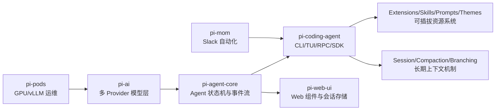

> 你让我做的这篇是“源码级深挖 + 全局视角”的版本。本文基于 `badlogic/pi-mono` 当前仓库结构与核心实现，重点回答三件事：它到底怎么搭起来的、为什么最近越来越火、相比常见 SDK/Agent 框架到底创新在哪。

### 先说结论

`pi-mono` 的爆火不是因为“又一个 AI SDK”，而是因为它把“模型调用、Agent 循环、终端交互、扩展生态、部署运维”做成了一条可拼装的工程链。

一句话概括它的产品哲学：

- 核心能力保持最小化（minimal core）
- 复杂能力交给扩展和包生态（extensions / skills / pi packages）
- 让用户改工作流，而不是被工作流绑架

这比很多“功能堆满但难改造”的 SDK 更适合真实团队落地。

### 全局架构：不是单点库，而是一个分层体系

从 monorepo 结构看，`pi-mono` 是明确分层的：

- `packages/ai`：统一多模型 Provider API
- `packages/agent`：状态化 Agent 循环（tool execution + event stream）
- `packages/coding-agent`：面向终端使用的完整产品层（CLI/TUI/RPC/SDK）
- `packages/tui`：高性能终端 UI 渲染框架
- `packages/web-ui`：浏览器侧 chat + artifacts 组件
- `packages/pods`：GPU/vLLM 部署与模型托管 CLI
- `packages/mom`：Slack bot 场景的上层应用



这张图最关键的信息是：`pi-coding-agent` 不是硬编码“超大功能体”，而是架在 `pi-ai + pi-agent-core` 之上的产品层。

### pi-ai：真正能跨 Provider 的“统一对话内核”

很多库号称统一 Provider，但通常只统一“请求格式”。`pi-ai` 做得更深：

- 统一了事件模型（`text_delta`、`toolcall_delta`、`thinking_delta`）
- 统一了 stop reason、usage、cost 结构
- 支持跨 Provider conversation handoff（含 thinking block 兼容）
- 支持 OAuth provider（Codex、Copilot、Gemini CLI、Antigravity）

一个很关键的点：它把 tool calling 的流式 partial JSON 做成了一等公民。

```ts
for await (const event of stream) {
  if (event.type === 'toolcall_delta') {
    const toolCall = event.partial.content[event.contentIndex];
    // partial arguments 可用于实时 UI（比如显示 path 已出现）
  }
}
```

这个能力在“长工具调用 + 实时前端反馈”场景里很实用，很多 SDK 只在 toolcall_end 给你完整结果。

### pi-agent-core：状态机化的 Agent 循环

`@mariozechner/pi-agent-core` 的核心价值不是“能调用工具”，而是把整个 loop 做成可订阅、可恢复、可插入策略的状态机。

事件链路很清晰：

- `agent_start`
- `turn_start`
- `message_start/update/end`
- `tool_execution_start/update/end`
- `turn_end`
- `agent_end`

这让 UI、日志、回放、重试、监控都可以解耦在事件层完成，不需要侵入 Agent 主循环。

### coding-agent：产品化层的真正护城河

很多项目卡在“SDK 能跑 demo，但做不成产品”。`coding-agent` 这层把产品化细节补齐了：

- 多运行模式：interactive / print / json / rpc / sdk
- session tree 与 fork
- 自动 compaction 与 overflow recovery
- 模型切换与 thinking 等级策略
- 扩展系统（commands/tools/ui/hooks/provider registration）

尤其 `AgentSession` 这层抽象做得很工程化：

- 统一模式共享会话生命周期
- 自动持久化与事件桥接
- 自动重试 + 自动压缩 + 队列消息（steer/follow-up）

```ts
// Shared between interactive/print/rpc
class AgentSession {
  // session persistence
  // auto compaction
  // retry logic
  // extension bridge
}
```

这意味着它不是“一个聊天循环”，而是一个可控的运行时。

### 上下文窗口问题：它不是回避，而是正面工程化

`pi` 处理上下文爆炸不是简单“截断”，而是结构化 compaction：

- 先估算上下文 token (`estimateContextTokens`)
- 判断是否触发压缩 (`shouldCompact`)
- 找 cut point（保证 toolResult 不被破坏）
- 生成结构化 summary（可带历史 summary 增量更新）
- 把 file operations（read/modified）附在摘要尾部

这段设计有两个亮点：

- 支持 split-turn（切点落在 turn 中间时，单独生成 turn prefix summary）
- 摘要里保留工程可继续的信息（路径、函数名、报错）

```ts
if (isSplitTurn && turnPrefixMessages.length > 0) {
  // 并行生成 history summary + turn prefix summary
}
summary += formatFileOperations(readFiles, modifiedFiles);
```

这比很多“纯文本摘要”更适合 coding 场景的断点恢复。

### 扩展系统：它不是插件 API，而是“Agent 行为编排层”

`extensions/types.ts` 暴露的能力非常强，远超常见“注册工具函数”级别：

- 生命周期 hook：`session_before_compact`、`session_before_tree`、`before_agent_start`
- 工具级 hook：`tool_call`、`tool_result`
- 输入拦截：`input`（可 transform / handled）
- UI 注入：header/footer/widget/custom editor/overlay
- Provider 注册：`registerProvider`（含 OAuth flow）

这使得你可以用扩展做这些大改：

- 自定义权限门禁
- 自定义 compaction 策略
- 子代理/计划模式（官方核心不内置，但可扩展实现）
- 企业内私有模型网关接入

这类能力是“平台级”而不是“函数级”。

### 资源加载器：把“可定制”真正落地

`DefaultResourceLoader` 做了一个很实用的现实问题：

- 用户级 + 项目级 + package 级资源合并
- 冲突检测（工具名、命令名、flag）
- 自动发现 AGENTS.md / CLAUDE.md / SYSTEM.md / APPEND_SYSTEM.md
- 可动态 extendResources + reload

这让“换团队、换项目、换机器”时的行为可迁移，不会变成硬编码配置地狱。

### 终端能力：pi-tui 不是 UI 糖衣，是性能工程

`pi-tui` 的价值不只“好看”：

- differential rendering（三策略更新）
- synchronized output（CSI 2026，减少闪烁）
- bracketed paste 和大文本粘贴处理
- overlay 系统、IME 光标定位（CJK 输入法友好）

终端工具最容易被忽略的一块是“交互稳定性”，它这块做得比很多 AI CLI 细。

### 为什么最近越来越火：不是营销，是“工程可控感”

从工程视角看，pi 的增长逻辑很清晰：

- 大模型工具从“玩具助手”走向“团队工作流基础设施”
- 团队不再只要一个对话框，而是要：可扩展、可审计、可部署、可恢复
- pi 在这些维度的“可控感”很强

它在 README 里明确“故意不内置某些能力（如 plan mode / sub-agent / MCP）”这件事也很关键：

- 对新手看似少功能
- 对工程团队反而是优势：核心稳定、扩展自由

### 跟常见 SDK/框架相比，它的创新点在哪里

### 创新点：统一事件语义而非只统一 API 调用

很多 SDK 统一 request/response；pi 统一的是“运行时事件”。

收益：

- UI/日志/回放/监控共享同一事件总线
- 更容易做跨模式（CLI/RPC/Web）一致行为

### 创新点：Compaction 是一等能力，不是补丁

它把压缩做成了可扩展策略点（含 before_compact hook），并保留文件操作语义。

收益：

- 长会话可持续
- 断点恢复质量高

### 创新点：Extension API 足够“动内脏”

不只是注册 tool，而是可改模型层、输入层、会话层、UI 层。

收益：

- 团队可以把 pi 变成自己内部平台
- 减少 fork 主仓维护成本

### 创新点：把部署侧（pods）纳入同一体系

`pi-pods` 让“模型部署（vLLM）+ agent 测试”在一个工具链内闭环。

收益：

- 从开发到部署路径更短
- 对自托管/成本敏感团队更友好

### 你在用 OpenClaw 时可以借鉴的思路

这部分是给你的“迁移价值”总结：

- 把“能力”抽成扩展接口，而不是把功能塞进核心
- 把长会话问题工程化（compaction + branch summary + file-op trace）
- 把 UI 事件和 agent 事件分层，不要耦合在单个对话循环里
- 做一套资源装配系统（global/project/package）降低协作摩擦

### 风险与边界（客观看）

它也不是没有代价：

- 高扩展性意味着行为组合复杂度高，调试门槛上升
- 需要好的扩展治理（命名冲突、权限、质量基线）
- 对“开箱即用、完全托管”的用户来说学习曲线会比封闭式产品高

但这恰好是它面向工程团队的取舍。

### 最后一句判断

`pi-mono` 值得关注，不是因为“它能调 LLM”，而是因为它提供了一个可演化的 Agent 工程底座：

- 下层模型能力可替换
- 中层会话/工具/状态可编排
- 上层交互与部署可按团队需求重组

在“AI 从 demo 走向生产协作”的阶段，这种架构思路会越来越有优势。