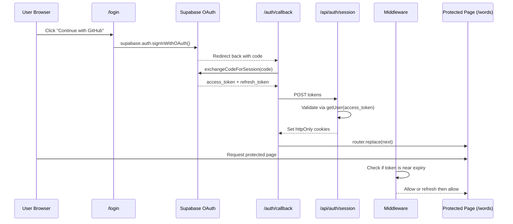
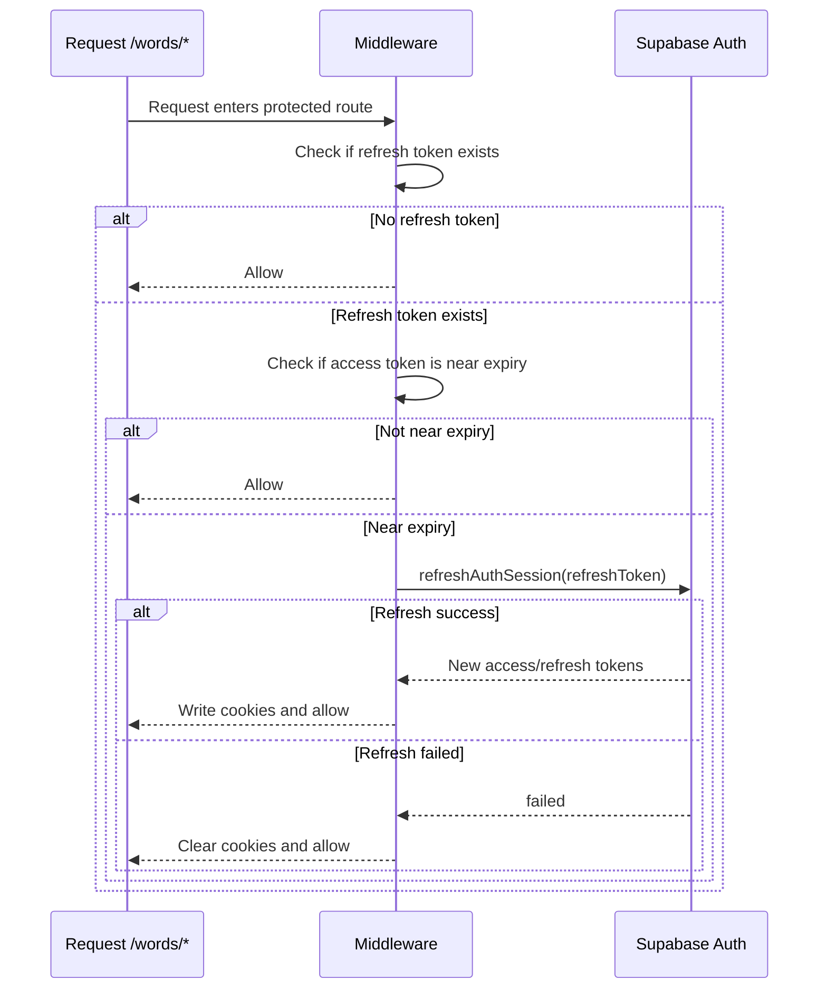
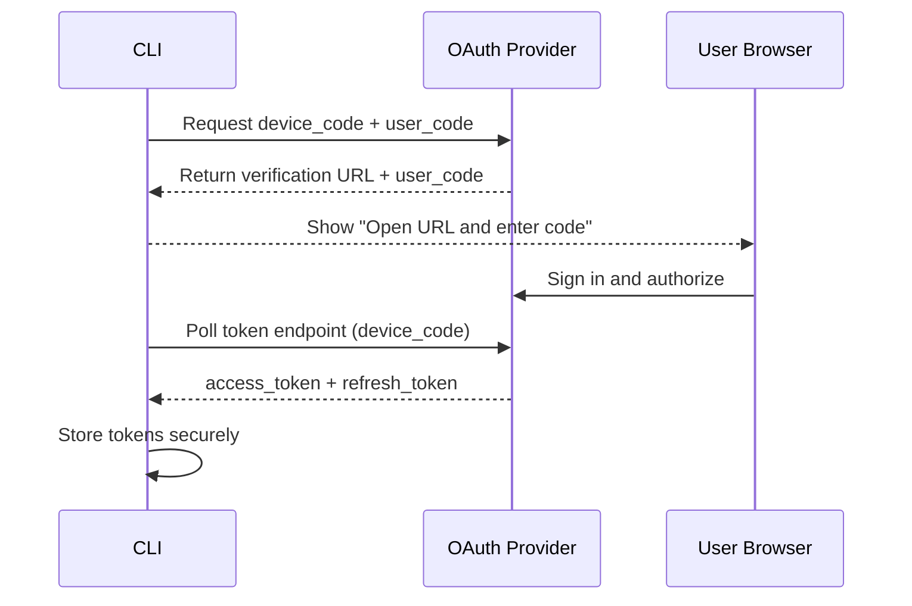
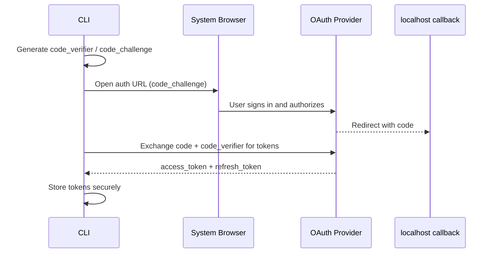

> 这篇文档按当前项目代码实现拆解：登录、回调、会话落库（Cookie）、中间件续期、服务端鉴权与 API 鉴权。

### 设计目标

这套认证方案的核心目标是：

- **前端登录体验顺滑**：浏览器端走 Supabase OAuth（GitHub）
- **服务端可安全鉴权**：通过 `httpOnly` Cookie 持有 token
- **自动续期减少掉线**：中间件在 access token 将过期时自动 refresh
- **SSR + API 统一鉴权**：页面与接口都能复用鉴权逻辑

### 认证主流程（登录到进入业务页）



### 登录入口：`/login`

登录页是浏览器端组件，关键动作：

- 调 `supabase.auth.signInWithOAuth({ provider: "github" })`
- 设置 `redirectTo=/auth/callback?next=...`

这一步只负责把用户带去 OAuth，不在这里存会话。

```ts
const redirectTo = `${window.location.origin}/auth/callback?next=${encodeURIComponent(nextPath)}`;

await supabase.auth.signInWithOAuth({
  provider: "github",
  options: { redirectTo },
});
```

### 回调页：`/auth/callback`

回调页做了三件关键事：

- 读 URL 中的 `code`（或 hash token）
- 调 `supabase.auth.exchangeCodeForSession(code)` 换取会话
- 把 `accessToken/refreshToken` POST 给 `/api/auth/session`

> 真正落 Cookie 的动作在服务端 API，而不是在浏览器 JS 里直接写。

```ts
const { data, error } = await supabase.auth.exchangeCodeForSession(code);
if (error || !data.session?.access_token || !data.session?.refresh_token) {
  throw new Error("登录失败：无法获取会话");
}

await fetch("/api/auth/session", {
  method: "POST",
  headers: { "Content-Type": "application/json" },
  body: JSON.stringify({
    accessToken: data.session.access_token,
    refreshToken: data.session.refresh_token,
  }),
});
```

### 会话落地：`/api/auth/session`

该接口做“校验 + 写 Cookie”两步：

- 用 `accessToken` 调 `supabase.auth.getUser(accessToken)` 验证 token 合法性
- 通过 `setAuthCookies` 写两个 `httpOnly` Cookie：
  - `sb-access-token`
  - `sb-refresh-token`

Cookie 策略：

- `httpOnly: true`
- `sameSite: "lax"`
- `secure: production`
- access token 短周期、refresh token 长周期（30 天）

这让前端脚本拿不到 token，减少 XSS 下 token 泄露风险。

```ts
const response = NextResponse.json({ user: data.user });

setAuthCookies(response, {
  accessToken: payload.accessToken,
  refreshToken: payload.refreshToken,
});

return response;
```

```ts
response.cookies.set("sb-access-token", accessToken, {
  httpOnly: true,
  secure: process.env.NODE_ENV === "production",
  sameSite: "lax",
  path: "/",
  maxAge: 60 * 60,
});
```

### 自动续期：`middleware.ts`

中间件只匹配：`/words/:path*`。

核心逻辑：

- 读 cookie 里的 access/refresh token
- `shouldRefreshAccessToken` 判断 access token 是否快过期（阈值约 15 分钟）
- 若需续期：`refreshAuthSession(refreshToken)`
- 成功则回写新 token；失败则清空 cookie

```ts
const accessToken = request.cookies.get("sb-access-token")?.value ?? null;
const refreshToken = request.cookies.get("sb-refresh-token")?.value ?? null;

if (!refreshToken || !shouldRefreshAccessToken(accessToken)) {
  return response;
}

const refreshed = await refreshAuthSession(refreshToken);
if (!refreshed) {
  // clear cookies
  return response;
}

response.cookies.set("sb-access-token", refreshed.accessToken, { httpOnly: true, path: "/" });
response.cookies.set("sb-refresh-token", refreshed.refreshToken, { httpOnly: true, path: "/" });
```



这层保证了“用户几乎无感续期”。

### 服务端页面鉴权：`lib/auth/server.ts`

服务端读取 `sb-access-token` 后调用 `getUserFromAccessToken`。

- `requireUser()` / `requireAuth()`：
  - 未登录时 `redirect(/login?next=当前路径)`
  - 已登录则返回 user / auth 对象

因此 SSR 页面（如词库页面）可直接在服务端判定身份。

```ts
export const requireAuth = async () => {
  const auth = await getServerAuth();
  if (!auth) {
    redirect(`/login?next=${encodeURIComponent(await resolveNextPath())}`);
  }
  return auth;
};
```

### API 鉴权（统一取 token）

`lib/auth.ts` 提供统一取 token 方法：

- `getAccessTokenFromRequest`
  - 优先读 `Authorization: Bearer ...`
  - 否则读 cookie
- `getRefreshTokenFromRequest`
  - 从 cookie 读取

这样 API 既能支持浏览器 cookie 场景，也能支持显式 Bearer token 场景（如扩展端）。

```ts
export const getAccessTokenFromRequest = (request: Request) => {
  const headerToken = request.headers
    .get("authorization")
    ?.replace(/^Bearer\s+/i, "")
    .trim();
  if (headerToken) return headerToken;

  const cookies = parseCookieHeader(request.headers.get("cookie"));
  return cookies.get("sb-access-token") ?? null;
};
```

### 方案优点与注意点

优点：

- **安全性更高**：token 不暴露给前端业务脚本（httpOnly）
- **SSR 友好**：服务端可直接鉴权和重定向
- **体验好**：自动 refresh，减少频繁掉登录
- **扩展性好**：web 与 extension 都有各自 refresh 路径

注意点：

- middleware 只匹配 `/words/*`，新增受保护路由时要同步更新 matcher
- refresh 失败后会清 cookie，业务侧要处理“重新登录”引导
- OAuth provider 增加时，登录页 providers 和 Supabase 控制台要一致

### 一句话总结

这套 Supabase Auth 的本质是：

**浏览器负责 OAuth 跳转与换码，服务端负责会话校验与 Cookie 落地，中间件负责续期，服务端页面/API 复用统一鉴权入口。**

既兼顾了安全，也兼顾了 SSR 与用户体验。

### 引申思考：CLI 工具如何做 OAuth

CLI 没有天然浏览器上下文，常见做法有两类：

- **Device Code Flow（设备码模式）**：CLI 显示验证码和授权地址，用户在浏览器输入验证码完成授权
- **Loopback + PKCE（本地回调模式）**：CLI 打开系统浏览器登录，并在本地临时端口接收 OAuth 回调

二者共同点：

- CLI 不直接保存账号密码
- 最终拿到的是 access token / refresh token
- token 通常保存到本机凭据系统（keychain/credential manager）或本地配置

### CLI OAuth 典型流程（Device Code）



```ts
// 伪代码：device code 轮询
const { device_code, user_code, verification_uri } = await requestDeviceCode();
console.log(`Open ${verification_uri} and enter code: ${user_code}`);

while (true) {
  const result = await pollToken(device_code);
  if (result.status === "authorization_pending") {
    await sleep(3000);
    continue;
  }
  if (result.access_token) {
    await saveToken(result);
    break;
  }
  throw new Error(result.error || "oauth_failed");
}
```

### CLI OAuth 典型流程（Loopback + PKCE）



```ts
// 伪代码：PKCE + 本地回调
const { codeVerifier, codeChallenge } = createPkcePair();
const authUrl = buildAuthUrl({ codeChallenge, redirectUri: "http://127.0.0.1:53682/callback" });
openBrowser(authUrl);

const code = await waitForLocalCallback();
const token = await exchangeToken({ code, codeVerifier });
await saveToken(token);
```

### 对比 Web 站点 OAuth 与 CLI OAuth

- Web 站点：更强调浏览器会话 + Cookie 持久化
- CLI 工具：更强调 token 安全存储 + 非浏览器环境可完成授权
- Web 常见刷新点在中间件/后端；CLI 常见刷新点在每次命令执行前检查 token 过期

### 实战建议（给 CLI 设计者）

- 优先使用 provider 官方推荐 flow（优先 PKCE/Device Code）
- token 尽量进系统 keychain，不要明文写入仓库
- 预留 `logout/revoke` 命令，支持快速失效 token
- 对 CI 场景单独设计（通常改用短期 PAT/OIDC，而不是交互式 OAuth）